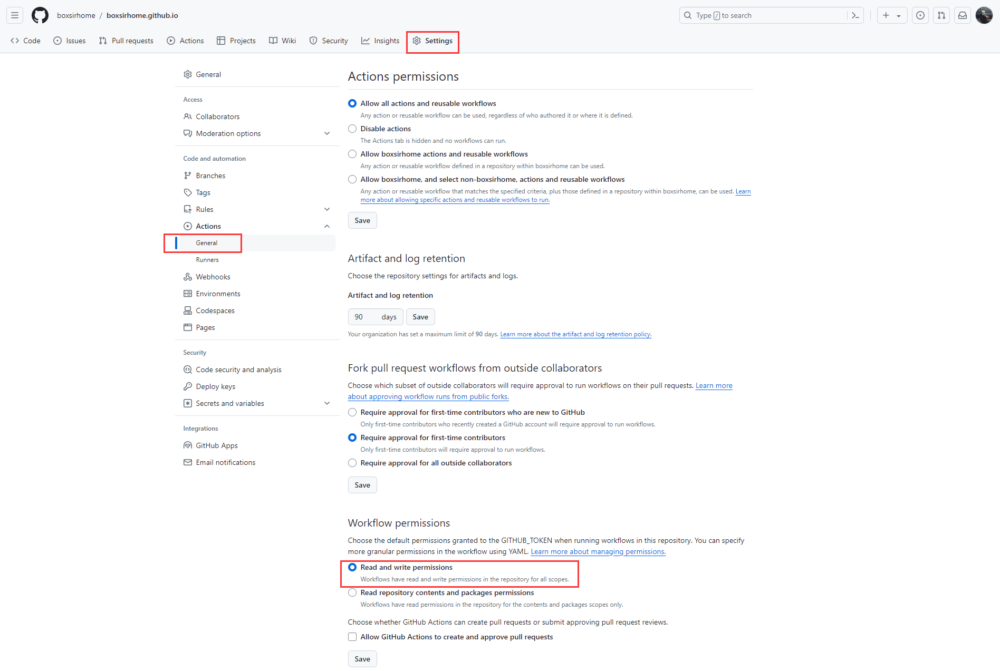
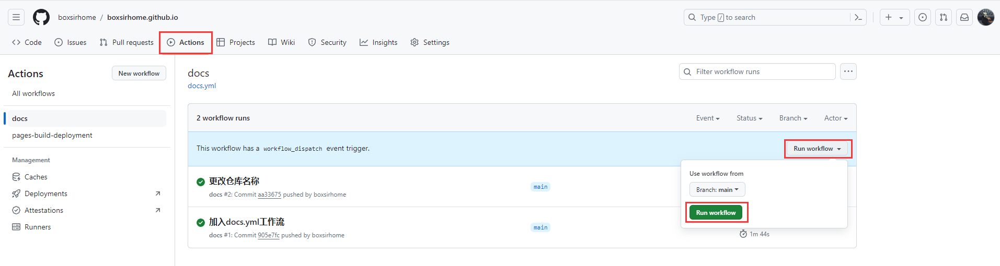
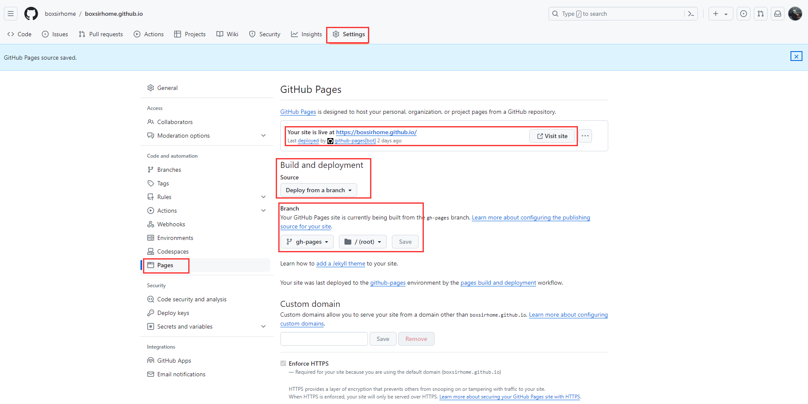

## 运行博客

### 环境准备

安装 [Node.js](https://nodejs.org/zh-cn)

安装 [VSCode](https://code.visualstudio.com/)

安装 Pnpm，在终端中输入下列命令安装 pnpm:

```sh
corepack enable
corepack prepare pnpm@latest --activate
```


### 下载远程仓库

在本地仓下执行

git clone [https://github.com/boxsirhome/boxsirhome.github.io.git](https://github.com/boxsirhome/boxsirhome.github.io.git)  #克隆远程项目


### 运行项目

使用 **vscode** 打开项目后在终端执行命令：

```sh
pnpm install   #下载依赖
pnpm docs:dev  #启动开发服务器
```

此时可以在浏览器中访问 [http://localhost:8088](http://localhost:8088) 看到项目启动 


## 自动部署

> 通过 GitHub Actions 实现推送即自动化部署

### 创建配置文件
1.在项目根目录下，创建 .github/workflows 文件夹，然后创建 .github/workflows/docs.yml 文件配置工作流。


2.把以下内容复制到 docs.yml 文件中
::: details 配置文件

```yml
name: docs

on:
  # 每当 push 到 main 分支时触发部署
  push:
    branches: [main]
  # 手动触发部署
  workflow_dispatch:

jobs:
  docs:
    runs-on: ubuntu-latest

    steps:
      - uses: actions/checkout@v4
        with:
          # “最近更新时间” 等 git 日志相关信息，需要拉取全部提交记录
          fetch-depth: 0

      - name: Setup pnpm
        uses: pnpm/action-setup@v2
        with:
          # 选择要使用的 pnpm 版本
          version: 8.11.0
          # 使用 pnpm 安装依赖
          run_install: true

      - name: Setup Node.js
        uses: actions/setup-node@v4
        with:
          # 选择要使用的 node 版本
          node-version: 16.17.1
          # 缓存 pnpm 依赖
          cache: pnpm

      # 运行构建脚本
      - name: Build VuePress site
        run: pnpm docs:build

      # 查看 workflow 的文档来获取更多信息
      # @see https://github.com/crazy-max/ghaction-github-pages
      - name: Deploy to GitHub Pages
        uses: crazy-max/ghaction-github-pages@v4
        with:
          # 部署到 gh-pages 的分支
          target_branch: gh-pages
          # 部署目录为 VuePress 的默认输出目录
          build_dir: src/.vuepress/dist
        env:
          # @see https://docs.github.com/cn/actions/reference/authentication-in-a-workflow#about-the-github_token-secret
          GITHUB_TOKEN: ${{ secrets.GITHUB_TOKEN }} 
```

:::

### 推送博客

通过 **git** 推送到自己的远程仓库

```sh
git add .                                 #添加所有文件到暂存区
git commit -m "first commit"              #提交暂存区内容到本地仓库
git branch -M main                        #将当前分支重命名为 main 分支（已是main省略这一步）
git remote add origin <remote-url>        #关联到远程仓库（已关联省略这一步）
git push -u origin main               #推送到远程main分支
```
### 检查Actions
1.提交完代码之后，在github的仓库中看下Actions下面的信息，看看是否执行成功了。

2.有报错的话，根据报错信息修改。例如权限问题报错

3.打开Settings->Actions->General 修改 Workflow permissions 为 Read and write permissions

4.再手动执行一下Actions

5.直到执行成功


### 构建部署
在Setting标签页中，选择Pages侧边栏，Source 选择  Deploy from a branch，然后在 Branch 标签下选择 gh-pages 分支和 root 目录，


可通过提供的网站地址，访问博客啦🎉


## 更新博客 :pushpin:

- 在vscode中更新博客内容后，进行 [推送博客](#推送博客) 的操作，git推送完成会自动执行GitHub Actions重新部署
- 如果希望博客的搜索功能，立即实现对新文章的搜索，需要前往 [Algolia Crawler](https://crawler.algolia.com/admin/crawlers/) 来手动重启爬虫，实现对新文章的索引。具体步骤，参考 **Algolia搜索>[执行爬虫](/about/decorate/algolia.html#执行爬虫)**