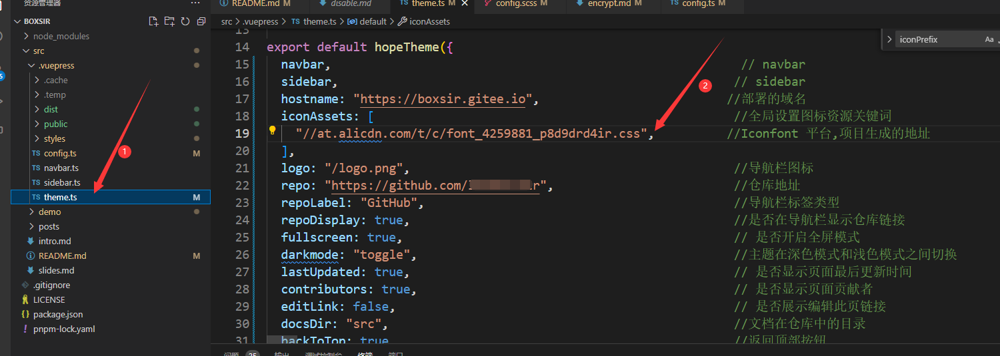

整个主题在多处都添加了 FontClass / 图片 格式图标的支持。

目前可以使用 iconfont、iconify 和 fontawesome 为你的项目添加图标，可以设置自己的图标资源。

同时，png/svg 格式的图标也是支持的。可以使用完整 URL 或路径名来添加图标。

具体 **参考主题>指南>界面>[图标支持](https://theme-hope.vuejs.press/zh/guide/interface/icon.html)**

## 图标设置

可以在多个地方使用图标。

- 页面: 在 frontmatter 中设置 `icon`

  此图标将用于路径导航、页面标题、导航栏生成项、侧边栏生成项、页面导航等。

- 导航栏: 在 NavbarItemConfig 中设置 `icon` 选项

- 侧边栏: 在 SidebarItemConfig 中设置 `icon` 选项

- 主页: 在功能项中设置 `icon` 选项

## 在 Markdown 中添加图标

你可以使用 `<HopeIcon />` 组件在 markdown 中添加图标。

- `icon` 属性接受与其他 `icon` 选项相同的内容，即：字体类名和图像 url
- `color` 属性接受一个 css 颜色值，它将用作图标颜色（可选）
- `size` 属性接受一个 css 大小值，该值将用作图标大小（可选）

例如：

```vue
<HopeIcon icon="home" color="red" />
<HopeIcon icon="/logo.svg" size="4rem" />
```

## 首次使用

### 新建项目

需要新建一个项目，对你网站的图标进行设置与管理:

1. 使用 GitHub 或微博登录 [Iconfont](https://www.iconfont.cn/)。
2. 在网站上方找到 “资源管理 → 我的项目”，点击右上角的 “新建项目” 图标。
3. 设置可以辨识的项目名称
4. `FontClass/Symbol 前缀` 填入 `icon-` (可以根据自己喜好填写，但需要将此值设置额外前缀 `iconfont` 并设置到在主题选项中的 `iconPrefix` ，如果填入的就是 `icon-` 则不需要设置主题选项中的 `iconPrefix` ，因为主题已经自动把 `iconPrefix` 设置成 `icon-` ，填了反而可能出现问题)
5. Font Family 请保持 `iconfont` 
   

### 导入图标

1. 在 iconfont 自由搜索寻找你想要使用的图标，并点击图标上的 “添加入库” 按钮
   

2. 在寻找完所有图标后，请点击右上角的 “添加入库” 图标，点击下方的 “添加至项目” 并选择你刚刚创建好的项目进行确定。
   

3. 请点击项目上方的 “Font Class” 按钮，并点击生成。
   

4. 生成链接
   

5. 将 css 地址设置到主题选项的 `iconAssets` 中
   

### 使用图标

1. 复制代码
   

   例如：`icon-bangbangtang-01`

2. 可以使用 `<HopeIcon />` 组件在 markdown 中添加图标。

   ```vue
   <HopeIcon icon="bangbangtang-01" size="3rem"/>   //去除掉"icon-"前缀，主题已经在theme.ts的"iconPrefix"中默认配置了
   ```

   其它位置图标支持，参考**主题文档>图标支持>[设置图标](https://theme-hope.vuejs.press/zh/guide/interface/icon.html#%E8%AE%BE%E7%BD%AE%E5%9B%BE%E6%A0%87)**

## 添加新图标 :pushpin:
- 如果需要在Iconfont 平台 **添加新项目和新图标**，重复[首次使用](#首次使用)的操作，将生成的CSS地址增加到`iconAssets`方法中。
- 如果需要在Iconfont 平台`navbar`项目中 **添加新图标**，重复 [导入图标](#导入图标) 的操作，将重新生成的新 CSS 地址替换 掉`iconAssets`方法中`navbar`项目图标。
- 如果需要在Iconfont 平台上传自己的图标，参考 [svg制作上传](https://blog.csdn.net/AdminGuan/article/details/121691426)