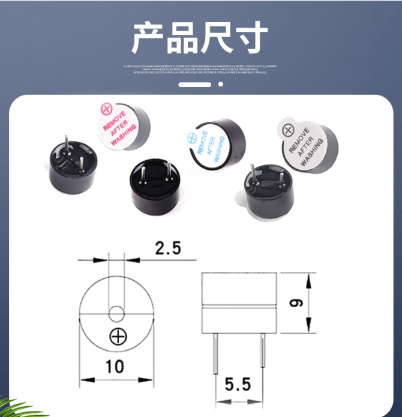
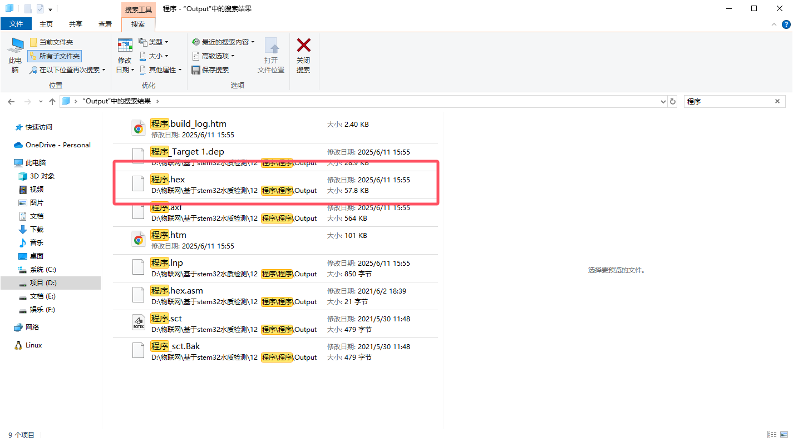
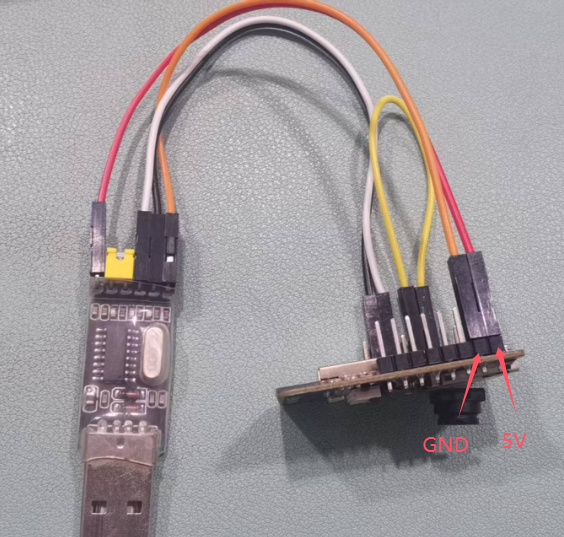
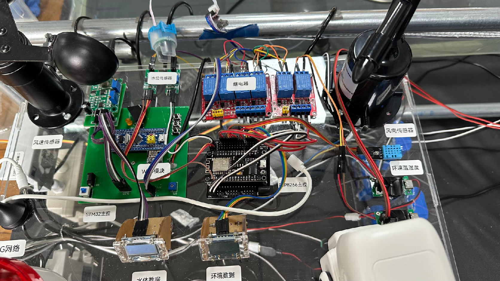

# **稻虾蟹共生养殖系统项目说明-V1.0**


## 一、认识物联网模块


### 主控模块：


主控板为ESP8266，链接环境温湿度传感器、雾化片驱动、水位传感器、继电器、OLED屏幕


#### 1、ESP8266主控板

<div style="display: flex; justify-content: center; gap: 50px;">
    
    
</div>


Arduino IDE软件esp32+esp8266离线安装包链接：https://pan.baidu.com/s/1LymkbGFzdjkwvs4E7MMi2g?pwd=8889 

CH340资料链接: https://pan.baidu.com/s/10xkZRh0lhhMzrGsPKYjVlw?pwd=l9hj 提取码：l9hj

#### 2、ESP8266扩展板

<div style="display: flex; justify-content: center; gap: 50px;">
    
    
</div>

#### 3、环境温湿度传感器

<div style="display: flex; justify-content: center; gap: 50px;">
    
    
</div>

DHT11资料下载链接：https://pan.baidu.com/s/1WdJK13-oJNpTJXn-8sp0DQ?pwd=8889提取码：8889


#### 4、水位传感器

<div style="display: flex; justify-content: center; gap: 50px;">
    
    
</div>

使用讲解视频，电路图，相关资料链接：
链接：https://pan.baidu.com/s/15i3dfnr396_Riqrt5KNIFg?pwd=cupr

模块测试视频：https://www.ixigua.com/6947472265965470239?utm_source=xiguastudio


#### 5、OLED显示屏

<div style="display: flex; justify-content: center; gap: 50px;">
    
    
</div>

新款0.96寸 4管脚 白色 焊好排针  使用说明：https://www.bilibili.com/opus/1019499397834080257

经典款0.96寸 4管脚 白色 焊好排针  使用说明：https://www.bilibili.com/opus/1019500909654179841

新款0.96寸4管脚资料链接：https://pan.baidu.com/s/1l9Az0SOl7TOfX1HwjdqMjg?pwd=8889 提取码: 8889 

0.96寸4管脚资料链接：https://pan.baidu.com/s/1Zp6dyui6dDvy03ossLSKnw?pwd=8889 提取码: 8889 


#### 6、继电器

<div style="display: flex; justify-content: center; gap: 50px;">
    
    
</div>

<div style="display: flex; justify-content: center; gap: 50px;">
    
    
</div>


#### 7、雾化驱动

<div style="display: flex; justify-content: center; gap: 50px;">
    
    
</div>


<div style="display: flex; justify-content: center; gap: 50px;">
    
    
</div>


#### 8、水泵

<div style="display: flex; justify-content: center; gap: 50px;">
    
    
</div>


#### 9、增氧泵


#### 10、报警器


### 水质检测模块：


以STM32系列单片机为核心设计水质检测系统，自行设计电源，选用PH传感器采集当前水体酸碱度， DS18B20温度采集、浊度传感器、OLED液晶显示，按键设置和蜂鸣器报警提醒构成。主要完成以下工作：

- 基于STM32单片机水质检测设计方案。
- 温度传感器、PH、浊度传感器等与单片机的接口电路设计。
- OLED液晶显示当前信息。
- 按键设置参数报警范围，通过蜂鸣器进行声光报警。
- 电源通过USB-5V供电为整个系统供电


#### 1、STM32F103C8T6开发板

<div style="display: flex; justify-content: center; gap: 50px;">
    
    
</div>


STM32最小系统资料包： https://pan.baidu.com/s/1voa4MsLO3xzu8Y-DC1J3OQ  提取码：3did 

STM32F103C8T6数据手册：https://pan.baidu.com/s/13T5tt842yjWaCk66cwV8Pg?pwd=pirq 提取码：pirq 


#### 2、DS18B20温度传感器

<div style="display: flex; justify-content: center; gap: 50px;">
    
    
</div>


#### 3、PH监测模块+PH电极探头


使用资料：

链接：https://pan.baidu.com/s/1NQ1DHlxOauFRJ2vkfJrxow 

提取码：1234 


#### 4、浊度传感器

<div style="display: flex; justify-content: center; gap: 50px;">
    
    
</div>


浊度资料链接: https://pan.baidu.com/s/1npfhQQ3SwOPjhHAwqtPSNw?pwd=egc8 


#### 5、OLED显示屏

<div style="display: flex; justify-content: center; gap: 50px;">
    
    
</div>


#### 6、WIFI模块

<div style="display: flex; justify-content: center; gap: 50px;">
    
    
</div>

ESP-01S  使用说明：https://www.bilibili.com/opus/1069977233630691330


#### 7、蜂鸣器

<div style="display: flex; justify-content: center; gap: 50px;">
    
    
</div>

#### 8、自锁开关

<div style="display: flex; justify-content: center; gap: 50px;">
    
    
</div>


### 环境监测

#### 1、溶解氧传感器

<div style="display: flex; justify-content: center; gap: 50px;">
    
    
</div>

地址：https://yunya.site/
账号：158****6824
密码：123456


#### 2、风速传感器

<div style="display: flex; justify-content: center; gap: 50px;">
    
    
</div>


#### 3、风向传感器

<div style="display: flex; justify-content: center; gap: 50px;">
    
    
</div>


#### 4、光照传感器

<div style="display: flex; justify-content: center; gap: 50px;">
    
    
</div>


#### 5、有线摄像头

<div style="display: flex; justify-content: center; gap: 50px;">
    
    
</div>


#### 6、ESP32-CAM摄像头

<div style="display: flex; justify-content: center; gap: 50px;">
    
    
</div>

ESP32-CAM（带摄像头）  使用教程视频：https://www.bilibili.com/opus/1011714834051366936

ESP32+ESP32-CAM资料: https://pan.baidu.com/s/1sS52Y4oghFh8jwgl9YQ3eg?pwd=8889 提取码：8889


### 供电系统

<div style="display: flex; justify-content: center; gap: 50px;">
    
    
</div>


### 土壤监测

<div style="display: flex; justify-content: center; gap: 50px;">
    
    
</div>


### AI小农

<div style="display: flex; justify-content: center; gap: 50px;">
    
    
</div>

<div style="display: flex; justify-content: center; gap: 50px;">
    
    
</div>


### 驱鸟车

<div style="display: flex; justify-content: center; gap: 50px;">
    
    
</div>


### 无人机


### 巡航船


## 二、物联网程序开发

### ESP8266开发

#### 1、CH340串口驱动

CH340资料链接: https://pan.baidu.com/s/10xkZRh0lhhMzrGsPKYjVlw?pwd=l9hj 提取码：l9hj

文件描述

USB转串口Windows一键式安装驱动程序，支持CH340和CH341，支持32/64位Windows 11/10/8.1/8/7/VISTA/XP，SERVER 2022/2019/2016/2012/2008/2003，2000/ME/98，通过微软数字签名认证，支持USB转UART的3线和9线SERIAL串口等，用于随产品发行到最终用户。

适用范围

CH340G，CH340T，CH340C，CH340N, CH340K, CH340E，CH340B，CH341A，CH341F, CH341T，CH341B，CH341C，CH341U


#### 2、开发软件arduino

安装Arduino IDE 、ESP32离线包、ESP8266离线包

Arduino IDE软件esp32+esp8266离线安装包链接：https://pan.baidu.com/s/1LymkbGFzdjkwvs4E7MMi2g?pwd=8889 

添加附加开发板地址打开Arduino IDE菜单 > 文件 >首选项，在 附加开发板管理器网址 输入框中，填入以下网址：

https://arduino.me/packages/esp32.json

https://arduino.me/packages/esp8266.json 

#### 3、程序开发

```c++
#define BLYNK_PRINT Serial
#include <U8g2lib.h>
#include <Wire.h>
#include <ESP8266WiFi.h>
#include <BlynkSimpleEsp8266.h>
#include <DHT.h>
#include <ESP8266WebServer.h>

ESP8266WebServer localServer(80);
U8G2_SSD1306_128X64_NONAME_1_SW_I2C u8g2(U8G2_R0, 3, 1, U8X8_PIN_NONE);

// 配置信息
char auth[] = "08cc7b9ef4f84ec9a17b87ee06594ffa";
char ssid[] = "test_wifi";
char pass[] = "123456888";

BlynkTimer timer;
DHT dht02(2, 11);
int vpin_value;

// 传感器状态
struct SensorStatus {
  bool dhtConnected = true;
  bool soilSensorConnected = true;
  unsigned long lastDHTRead = 0;
};

SensorStatus sensorStatus;

void sendSensorData() {
  float temp = NAN;
  float humi = NAN;
  int soil = -1;

  // 读取DHT传感器（限制读取频率）
  if (millis() - sensorStatus.lastDHTRead > 2000) {
    temp = dht02.readTemperature();
    humi = dht02.readHumidity();
    sensorStatus.lastDHTRead = millis();

    if (isnan(temp) || isnan(humi)) {
      sensorStatus.dhtConnected = false;
    } else {
      sensorStatus.dhtConnected = true;
    }
  }

  soil = analogRead(A0);
  sensorStatus.soilSensorConnected = (soil != 0 && soil != 1023); // 0或1023通常表示传感器问题

  // 发送到Blynk
  Blynk.virtualWrite(V0, sensorStatus.dhtConnected ? temp : -1);
  Blynk.virtualWrite(V1, sensorStatus.dhtConnected ? humi : -1);
  Blynk.virtualWrite(V2, sensorStatus.soilSensorConnected ? soil : -1);
}

void displaySensorData() {
  u8g2.firstPage();
  do {
    u8g2.setFont(u8g2_font_unifont_t_chinese3);
    u8g2.setFontPosTop();

    // 温度
    u8g2.setCursor(0, 0);
    if (!sensorStatus.dhtConnected) {
      u8g2.print("wendu: ERROR");
    } else {
      u8g2.print(String("wendu: ") + String(dht02.readTemperature()));
      u8g2.drawCircle(95, 2, 2, U8G2_DRAW_ALL);
      u8g2.setCursor(100, 0);
      u8g2.print("C");
    }

    // 湿度
    u8g2.setCursor(0, 20);
    if (!sensorStatus.dhtConnected) {
      u8g2.print("shidu: ERROR");
    } else {
      u8g2.print(String("shidu: ") + String(dht02.readHumidity()) + "%");
    }

    // 水位
    u8g2.setCursor(0, 40);
    if (!sensorStatus.soilSensorConnected) {
      u8g2.print("shuiwei: ERROR");
    } else {
      u8g2.print(String("shuiwei: ") + String(analogRead(A0)));
    }
  } while (u8g2.nextPage());
}

BLYNK_WRITE(V3) {
  digitalWrite(5, param.asInt() ? HIGH : LOW);  // D1 → GPIO5
}
BLYNK_WRITE(V4) {
  digitalWrite(4, param.asInt() ? HIGH : LOW);  // D2 → GPIO4
}
BLYNK_WRITE(V5) {
  digitalWrite(0, param.asInt() ? HIGH : LOW);  // D3 → GPIO0
}
BLYNK_WRITE(V6) {
  digitalWrite(14, param.asInt() ? HIGH : LOW); // D5 → GPIO14
}
BLYNK_WRITE(V7) {
  digitalWrite(12, param.asInt() ? HIGH : LOW); // D6 → GPIO12
}
BLYNK_WRITE(V8) {
  digitalWrite(13, param.asInt() ? HIGH : LOW); // D7 → GPIO13
}

void handleSensors() {
  float temp = dht02.readTemperature();
  float humi = dht02.readHumidity();
  int waterLevel = analogRead(A0);
  String json = "{";
  json += "\"status\":{";
  json += "\"dht\":" + String(sensorStatus.dhtConnected ? 1 : 0) + ",";
  json += "\"soil\":" + String(sensorStatus.soilSensorConnected ? 1 : 0);
  json += "},";
  json += "\"data\":{";
  json += "\"temperature\":" + (sensorStatus.dhtConnected ? String(temp) : "null") + ",";
  json += "\"humidity\":" + (sensorStatus.dhtConnected ? String(humi) : "null") + ",";
  json += "\"water_level\":" + (sensorStatus.soilSensorConnected ? String(waterLevel) : "null");
  json += "}}";
  localServer.send(200, "application/json", json);
}

void handleControl() {
  if (!localServer.hasArg("pin") || !localServer.hasArg("state")) {
    localServer.send(400, "application/json",
                     "{\"code\":400,\"error\":\"Missing 'pin' or 'state'\"}");
    return;
  }

  String pinStr = localServer.arg("pin");
  String stateStr = localServer.arg("state");

  if (pinStr != "V3" && pinStr != "V4" && pinStr != "V5" &&
      pinStr != "V6" && pinStr != "V7" && pinStr != "V8") {
    localServer.send(400, "application/json",
                     "{\"code\":400,\"error\":\"Invalid 'pin'\"}");
    return;
  }

  int pin;
  if (pinStr == "V3") pin = 5;
  else if (pinStr == "V4") pin = 4;
  else if (pinStr == "V5") pin = 0;
  else if (pinStr == "V6") pin = 14;
  else if (pinStr == "V7") pin = 12;
  else if (pinStr == "V8") pin = 13;

  bool state = (stateStr == "1");
  digitalWrite(pin, state ? HIGH : LOW);

  String response = "{\"code\":200,\"pin\":\"" + pinStr + "\",\"state\":" + stateStr + "}";
  localServer.send(200, "application/json", response);
}

void setup() {
  u8g2.setI2CAddress(0x3C * 2);
  u8g2.begin();
  Serial.begin(9600);
  Blynk.begin(auth, ssid, pass, IPAddress(182, 61, 28, 31), 8080);
  dht02.begin();

  u8g2.enableUTF8Print();

  pinMode(5, OUTPUT);   // D1
  pinMode(4, OUTPUT);   // D2
  pinMode(0, OUTPUT);   // D3
  pinMode(14, OUTPUT);  // D5
  pinMode(12, OUTPUT);  // D6
  pinMode(13, OUTPUT);  // D7

  timer.setInterval(2000L, sendSensorData);
  timer.setInterval(1000L, displaySensorData);

  localServer.on("/sensors", handleSensors);
  localServer.on("/control", HTTP_GET, handleControl);
  localServer.begin();

}

void loop() {
  Blynk.run();
  timer.run();
  localServer.handleClient();
}
```

#### 4、烧录步骤

将ESP8266通过USB链接电脑


查询串行端口


选择库：打开开发工具-->导入程序-->工具栏(工具)-->开发板-->ESP8266


开发工具中选择端口：工具-->端口-->串行端口


编译程序：①和②选择无误后，点击③，出现④表示程序正在编译


程序上传至开发板：出现①中白色字体内容，表示编程成功，点击②的按钮上传程序到开发板


程序烧录成功


### STM32开发

#### 1、CH340串口驱动

CH340资料链接: https://pan.baidu.com/s/10xkZRh0lhhMzrGsPKYjVlw?pwd=l9hj 提取码：l9hj

文件描述

USB转串口Windows一键式安装驱动程序，支持CH340和CH341，支持32/64位Windows 11/10/8.1/8/7/VISTA/XP，SERVER 2022/2019/2016/2012/2008/2003，2000/ME/98，通过微软数字签名认证，支持USB转UART的3线和9线SERIAL串口等，用于随产品发行到最终用户。

适用范围

CH340G，CH340T，CH340C，CH340N, CH340K, CH340E，CH340B，CH341A，CH341F, CH341T，CH341B，CH341C，CH341U


#### 2、开发软件Keil

Keil uVision 5 MDK版软件安装包下载及安装教程

https://zhuanlan.zhihu.com/p/1903019173711418696


#### 3、程序开发

```c
// 主程序入口main.c
#include "sys.h"
#include "delay.h"
#include "gpio.h"
#include "OLED_I2C.h"
#include "ds18b20.h"
#include "usart1.h"
#include "usart3.h"
#include "esp8266.h"
#include "adc.h"
#include <stdio.h>
#include <stdlib.h>
#include <string.h>

#define RATIO  4.51/4.08

dataPoint_t DataPoint;

u8    tempSetVal=40;  //温度上限
u8 shuaxin = 0;  //刷新标志
u8 setFlag = 0;  //设置标志
u16 Ph_min = 300,Ph_max = 900;   //PH下限上限
u16 TurSetMax=1000;  //浊度上限

unsigned long int avgValue;	//Store the average value of the sensor feedback 

char display[16];

void InitDisplay(void)   //初始化显示
{
	  unsigned char i=0;
	  
	  OLED_ShowStr(0, 2, "PH:", 2,0);
	  for(i=0;i<2;i++)OLED_ShowCN(i*16,4,i+0,0);//显示中文：温度
	  for(i=0;i<2;i++)OLED_ShowCN(i*16,6,i+2,0);//显示中文：浊度
	  OLED_ShowChar(32,4,':',2,0);
	  OLED_ShowChar(32,6,':',2,0);
}

void displaySetValue(void)  //显示设置的值
{
	  if(setFlag == 1 ||setFlag == 2)
		{
				sprintf(display,"%5.2f",(float)Ph_min/100); 
				OLED_ShowStr(40, 4,(u8 *)display, 2,setFlag+1-1);
			
				sprintf(display,"%5.2f",(float)Ph_max/100); 
				OLED_ShowStr(40, 6,(u8 *)display, 2,setFlag+1-2);
		}
		if(setFlag == 3)
		{
				sprintf(display,"%02d",tempSetVal); 
				OLED_ShowStr(40, 4,(u8 *)display, 2,setFlag+1-4);
		}
		if(setFlag == 4)
		{
				sprintf(display,"%04d",TurSetMax); 
				OLED_ShowStr(40, 4,(u8 *)display, 2,setFlag+1-5);
		}
}

void keyscan(void)   //按键扫描
{
	 unsigned char i=0;
	
	 if(KEY1 == 0) //设置键
	 {
			delay_ms(20);
		  if(KEY1 == 0)
			{
					while(KEY1 == 0);
				  BEEP=0;
				  setFlag ++;
				  if(setFlag == 1)
					{
							OLED_CLS();    //清屏
						  for(i=0;i<2;i++)OLED_ShowCN(i*16+32,0,i+8,0);//显示中文：设置
						  OLED_ShowStr(62, 0, " PH", 2,0);
						  for(i=0;i<2;i++)OLED_ShowCN(i*16,4,i+4,0);//显示中文：下限
							for(i=0;i<2;i++)OLED_ShowCN(i*16,6,i+6,0);//显示中文：上限
						  OLED_ShowChar(32,4,':',2,0);
						  OLED_ShowChar(32,6,':',2,0);
						  
					}
					if(setFlag == 3)
					{
							for(i=0;i<2;i++)OLED_ShowCN(i*16+64,0,i+0,0);//显示中文：温度
						  for(i=0;i<2;i++)OLED_ShowCN(i*16,4,i+6,0);//显示中文：上限
						  OLED_ShowStr(56, 4, "        ", 2,0);
						  OLED_ShowCentigrade(56, 4);    //℃
						  OLED_ShowStr(0, 6, "                ", 2,0);
					}
					if(setFlag == 4)
					{
							for(i=0;i<2;i++)OLED_ShowCN(i*16+64,0,i+2,0);//显示中文：浊度
						  OLED_ShowStr(72, 4, "NTU", 2,0);
					}
					if(setFlag >= 5)
					{
						  setFlag = 0;
							OLED_CLS();    //清屏
						  InitDisplay();
						  
					}
					displaySetValue();
			}
	 }
	 if(KEY2 == 0) //加键
	 {
			delay_ms(100);
		  if(KEY2 == 0)
			{
					if(setFlag == 1)
					{
						  if(Ph_max-Ph_min > 10)Ph_min+=10;
					}
					if(setFlag == 2)
					{
							if(Ph_max < 1400)Ph_max+=10;
					}
					if(setFlag == 3)
					{
							if(tempSetVal<99)tempSetVal++;
					}
					if(setFlag == 4)
					{
						  if(TurSetMax<3000)TurSetMax+=10;
					}
					displaySetValue();   //显示没有设置值
			}
	 }
	 if(KEY3 == 0) //减键
	 {
			delay_ms(100);
		  if(KEY3 == 0)
			{
					if(setFlag == 1)
					{
						  if(Ph_min >= 10)Ph_min-=10;
					}
					if(setFlag == 2)
					{
							if(Ph_max-Ph_min > 10)Ph_max-=10;
					}
					if(setFlag == 3)
					{
							if(tempSetVal>0)tempSetVal--;
					}
					if(setFlag == 4)
					{
						  if(TurSetMax>=10)TurSetMax-=10;
					}
					displaySetValue();   //显示没有设置值
			}
	 }
}

void Get_PH(void)    //获取PH
{
	  u16 buf[10];//buffer for read analog
	  u8 i,j;	
	  float phValue=0.0;
	
		for(i=0;i<10;i++)	//Get 10 sample value from the sensor for smooth the value
		{
			buf[i]=Get_Adc_Average(ADC_Channel_8,10); 
		}
		for(i=0;i<9;i++)	//sort the analog from small to large
		{
				for(j=i+1;j<10;j++)
				{
						if(buf[i]>buf[j])
						{
							int temp=buf[i];
							buf[i]=buf[j]; 
							buf[j]=temp;
						}
				}
		}
		avgValue=0;
		for(i=2;i<8;i++)	//take the average value of 6 center sample 
		avgValue+=buf[i];
    phValue=((float)avgValue*5.0/4095/6)*RATIO; //convert the analog into millivolt
		DataPoint.PH=(phValue*(-5.290))+23.053;	//convert the millivolt into pH value 
		DataPoint.PH=DataPoint.PH*100;
		if(DataPoint.PH<0.0)DataPoint.PH=0.0;
		if(DataPoint.PH>1400.0)DataPoint.PH=1400.0;
}

void Get_Turbidity(void)   //获取浑浊度
{
		float T;
	  u16 adcx = 0;
	
	  adcx = Get_Adc_Average(ADC_Channel_9,20);//读取AD值
		T = adcx;
		T = T*(3.3/4096)+1.72;
		if(T < 2.5)
		{
				T = 3000;	
		}
		else 
		{
				T = (-1120.4*T*T+5742.3*T-4352.9);	//Tul是AD值
		}
		if(T < 0)
		{
			T = 0;
		}
		DataPoint.Turbidity = (u16)T;
		
		if(DataPoint.Turbidity > 3000)DataPoint.Turbidity = 3000;
}

int main(void)
{
	  u16 timeCount1 = 300;
	  u16 timeCount2 = 10;
	  u8 shanshuo=0;
	
		delay_init();	           //延时函数初始化	 
    NVIC_Configuration();	   //中断优先级配置
	  delay_ms(200); 
	  I2C_Configuration();     //IIC初始化
	  Adc_Init();		  	      	//ADC初始化	
	  OLED_Init();             //OLED液晶初始化
	  OLED_CLS();              //清屏
	  OLED_ShowStr(0, 2,"   loading...   ", 2,0);
	  ESP8266_Init();
	  OLED_CLS();              //清屏
	  InitDisplay();
		KEY_GPIO_Init();        //按键引脚初始化
	  DS18B20_GPIO_Init();
	  DS18B20_Init();         //初始化显示
	  uart1_Init(9600);
    
		while(1)
		{ 
			   keyscan();  //按键扫描
         timeCount1 ++;
			   if(timeCount1 >= 300 && !setFlag)   //延时一段时间读取
				 {
						timeCount1 = 0;
					 
					  shanshuo=!shanshuo;
					 
					  Get_PH() ;      //获取PH
					  /*超限的时候闪烁显示*/
					  if((DataPoint.PH<=Ph_min || DataPoint.PH>=Ph_max) && shanshuo)
						{
								OLED_ShowStr(32, 2,"     ", 2,0);
						}
						else
						{
								sprintf(display,"%5.2f ",(float)DataPoint.PH/100); 
								OLED_ShowStr(32, 2,(u8 *)display, 2,0);
						}
					
					 
					  DataPoint.temperature = ReadTemperature();//读取温度
						/*超限的时候闪烁显示*/
						if((DataPoint.temperature>=tempSetVal) && shanshuo)
						{
								OLED_ShowStr(40, 4,"    ", 2,0);
						}
						else
						{
								sprintf(display,"%02d",DataPoint.temperature); 
								OLED_ShowStr(40, 4,(u8 *)display, 2,0);
							  OLED_ShowCentigrade(56, 4);    //℃
						}
					 
					  Get_Turbidity() ;
						/*超限的时候闪烁显示*/
						if((DataPoint.Turbidity>=TurSetMax) && shanshuo)
						{
								OLED_ShowStr(40, 6,"       ", 2,0);
						}
						else
						{
								sprintf(display,"%dNTU   ",DataPoint.Turbidity); 
								OLED_ShowStr(40, 6,(u8 *)display, 2,0);
						}
						
						if((DataPoint.PH<=Ph_min || DataPoint.PH>=Ph_max)||(DataPoint.temperature>=tempSetVal)||(DataPoint.Turbidity>=TurSetMax))BEEP= ~BEEP;else BEEP=0;  //超限蜂鸣器报警
				 }
				 timeCount2 ++;
				 if(timeCount2 >= 900)
				 {
							timeCount2 = 0;
							CloudPlatform_SendData(&DataPoint);  //上报数据到云平台
				 }
			   delay_ms(1);
		}
}


```

```c
// WIFI模块 esp8266.c
#include "stm32f10x.h"
#include "usart3.h"
#include "esp8266.h"
#include "delay.h"
#include <string.h>
#include <stdio.h>

#define  ESP8266_BUF         Usart3RecBuf 
#define  ESP8266_CNT         Rx3Counter
#define  STM32_RX1BUFF_SIZE  USART3_RXBUFF_SIZE

#define ESP8266_WIFI_INFO	  	"AT+CWJAP=\"test_wifi\",\"123456888\"\r\n"        //接入的WIFI名称和密码
#define ESP8266_SERVER_INFO		"AT+CIPSTART=\"TCP\",\"www.wztdzmcu.com\",6002\r\n"      //云平台的IP和端口
#define DEVID		"82525****3680"	       //云平台的设备ID

unsigned short esp8266_cntPre = 0;

//==========================================================
//	函数名称：	ESP8266_Clear
//
//	函数功能：	清空缓存
//
//	入口参数：	无
//
//	返回参数：	无
//
//	说明：	
//==========================================================
void ESP8266_Clear(void)
{
	memset(ESP8266_BUF, 0, sizeof(ESP8266_BUF));
	ESP8266_CNT = 0;
}

//==========================================================
//	函数名称：	ESP8266_WaitRecive
//
//	函数功能：	等待接收完成
//
//	入口参数：	无
//
//	返回参数：	REV_OK-接收完成		REV_WAIT-接收超时未完成
//
//	说明：		循环调用检测是否接收完成
//==========================================================
_Bool ESP8266_WaitRecive(void)
{
	if(ESP8266_CNT == 0) 							//如果接收计数为0 则说明没有处于接收数据中，所以直接跳出，结束函数
		return REV_WAIT;
		
	if(ESP8266_CNT == esp8266_cntPre)				//如果上一次的值和这次相同，则说明接收完毕
	{
		ESP8266_CNT = 0;							//清0接收计数
			
		return REV_OK;								//返回接收完成标志
	}
		
	esp8266_cntPre = ESP8266_CNT;					//置为相同
	
	return REV_WAIT;								//返回接收未完成标志
}

//==========================================================
//	函数名称：	ESP8266_SendCmd
//
//	函数功能：	发送命令
//
//	入口参数：	cmd：命令
//				res：需要检查的返回指令
//
//	返回参数：	0-成功	1-失败
//
//	说明：		
//==========================================================
_Bool ESP8266_SendCmd(char *cmd, char *res, u16 time)
{	
  uart3_send((unsigned char *)cmd,strlen((const char *)cmd));
	
	while(time--)
	{
		if(ESP8266_WaitRecive() == REV_OK)							//如果收到数据
		{
			if(strstr((const char *)ESP8266_BUF, res) != NULL)		//如果检索到关键词
			{
				ESP8266_Clear();									//清空缓存
				
				return 0;
			}
		}
		
		delay_ms(1);
	}
	
	return 1;

}

//==========================================================
//	函数名称：	ESP8266_SendData
//
//	函数功能：	发送数据
//
//	入口参数：	data：数据
//				len：长度
//
//	返回参数：	无
//
//	说明：		
//==========================================================
void ESP8266_SendData(unsigned char *data, unsigned short len)
{

	char cmdBuf[32];
	
	ESP8266_Clear();								//清空接收缓存
	sprintf(cmdBuf, "AT+CIPSEND=%d\r\n", len);		//发送命令
	if(!ESP8266_SendCmd(cmdBuf, ">", 200))				//收到‘>’时可以发送数据
	{
			uart3_send(data , len);         //发送设备连接请求数据
	}
}


//==========================================================
//	函数名称：	CloudPlatform_SendData
//
//	函数功能：	上传数据到平台
//
//	返回参数：	无
//
//	说明：		
//==========================================================
void CloudPlatform_SendData(const dataPoint_t * const data)
{
		char cmdBuf[512],buf[128];
	  unsigned char len=0;

	  memset(cmdBuf, 0, sizeof(cmdBuf));
	
		sprintf(cmdBuf,"MQTT|%s|test|",DEVID);
	  len = strlen(cmdBuf);
	  cmdBuf[len] = '{';
	  
	  memset(buf, 0, sizeof(buf));
	  sprintf(buf,"\"ph\":%.2f,",(float)(data->PH)/100);
	  strcat(cmdBuf, buf);
	
	  memset(buf, 0, sizeof(buf));
	  sprintf(buf,"\"temp\":%d,",data->temperature);
	  strcat(cmdBuf, buf);
	
	  memset(buf, 0, sizeof(buf));
	  sprintf(buf,"\"tur\":%d",data->Turbidity);
	  strcat(cmdBuf, buf);
	
	  len = strlen(cmdBuf);
	  cmdBuf[len] = '}';
	
	  strcat(cmdBuf, "\r\n");
	  len = strlen(cmdBuf);

	  ESP8266_SendData((unsigned char *)cmdBuf, len);  
}

//==========================================================
//	函数名称：	ESP8266_GetIPD
//
//	函数功能：	获取平台返回的数据
//
//	入口参数：	等待的时间(乘以10ms)
//
//	返回参数：	平台返回的原始数据
//
//	说明：		不同网络设备返回的格式不同，需要去调试
//				如ESP8266的返回格式为	"+IPD,x:yyy"	x代表数据长度，yyy是数据内容
//==========================================================
unsigned char *ESP8266_GetIPD(unsigned short timeOut)
{

	char *ptrIPD = NULL;
	
	do
	{
		if(ESP8266_WaitRecive() == REV_OK)								//如果接收完成
		{
			ptrIPD = strstr((char *)ESP8266_BUF, "IPD,");				//搜索“IPD”头
			if(ptrIPD == NULL)											//如果没找到，可能是IPD头的延迟，还是需要等待一会，但不会超过设定的时间
			{
				//printf("\"IPD\" not found\r\n");
			}
			else
			{
				ptrIPD = strchr(ptrIPD, ':');							//找到':'
				if(ptrIPD != NULL)
				{
					ptrIPD++;
					return (unsigned char *)(ptrIPD);
				}
				else
					return NULL;
				
			}
		}
		delay_ms(5);													//延时等待
	} while(timeOut--);
	
	return NULL;														//超时还未找到，返回空指针

}

//==========================================================
//	函数名称：	ESP8266_Init
//
//	函数功能：	初始化ESP8266
//
//	入口参数：	无
//
//	返回参数：	无
//
//	说明：		
//==========================================================
void ESP8266_Init(void)
{
	USART3_Init(115200);   //串口初始化
	
	ESP8266_Clear();
	while(ESP8266_SendCmd("AT\r\n\r", "OK", 500))         //测试
	delay_ms(500);
	
	while(ESP8266_SendCmd("AT+RESTORE\r\n", "OK", 2000)) //先清除一下数据
	delay_ms(1000);
	
	while(ESP8266_SendCmd("AT+RST\r\n\r", "ready", 1000)) //复位
	delay_ms(500);

	while(ESP8266_SendCmd("AT+CWMODE=1\r\n", "OK", 500))  //设置为STA模式
	delay_ms(1000);

	while(ESP8266_SendCmd(ESP8266_WIFI_INFO, "WIFI CONNECTED", 2000)) //设置wifi名称，密码
	delay_ms(1000);
	delay_ms(1000);
	do
	{
			if(ESP8266_WaitRecive() == REV_OK)
			{
					 if(strstr((char *)ESP8266_BUF, "WIFI GOT IP")!=NULL) //等待WIFI连接成功
					 {
							break;
					 }
			}
			delay_ms(1000);
	}while(1);
	while(ESP8266_SendCmd(ESP8266_SERVER_INFO, "CONNECT", 1000))  //接入服务器
	delay_ms(1000);
	delay_ms(1000);
}

```

#### 4、程序构建

修改程序参数：接入的WIFI名称和密码、云平台的IP和端口、平台设备ID


配置目标选项：

点击①目标选项按钮-->点击②Device按钮-->选择③STM32F103C8


继续选择①Output选项-->点击②选择输出文件位置-->填写③输出的文件名-->勾选④创建HEX文件


点击①构建，出现②程序构建成功


找到可烧录的单片机程序



#### 5、烧录步骤

使用USB转TTL串口下载器链接STM32

<div style="display: flex; justify-content: center; gap: 50px;">
    
    
</div>

| 串口下载器 |           STM32            |
| :--------: | :------------------------: |
|     5V     |             5V             |
|    GND     |            GND             |
|    TXD     |            A10             |
|    RXD     |             A9             |
|            | BOOT0切到1，烧录程序后复原 |

链接到电脑


查询串行端口


打开mcuisp烧录软件，选择HEX烧录程序


在mcuisp选项栏选择PROT-->选择查询到串行端口


按下①开始编程，烧录程序，如果在等待没反映，按下STM32开发板上的RESET按钮，出现②表示程序烧录成功


### ESP32-CAM摄像头开发

#### 1、CH340串口驱动

CH340资料链接: https://pan.baidu.com/s/10xkZRh0lhhMzrGsPKYjVlw?pwd=l9hj 提取码：l9hj

文件描述

USB转串口Windows一键式安装驱动程序，支持CH340和CH341，支持32/64位Windows 11/10/8.1/8/7/VISTA/XP，SERVER 2022/2019/2016/2012/2008/2003，2000/ME/98，通过微软数字签名认证，支持USB转UART的3线和9线SERIAL串口等，用于随产品发行到最终用户。

适用范围

CH340G，CH340T，CH340C，CH340N, CH340K, CH340E，CH340B，CH341A，CH341F, CH341T，CH341B，CH341C，CH341U


#### 2、开发软件arduino

安装Arduino IDE 、ESP32离线包、ESP8266离线包

Arduino IDE软件esp32+esp8266离线安装包链接：https://pan.baidu.com/s/1LymkbGFzdjkwvs4E7MMi2g?pwd=8889 

添加附加开发板地址打开Arduino IDE菜单 > 文件 >首选项，在 附加开发板管理器网址 输入框中，填入以下网址：

https://arduino.me/packages/esp32.json

https://arduino.me/packages/esp8266.json 


#### 3、程序开发

选择ESP32-CAM示例：文件-->示例-->ESP32-->Camera-->CameraWebServer


生成四个文件


替换CameraWebServer.ino中的代码程序

```c++
#include "esp_camera.h"
#include <WiFi.h>

#define CAMERA_MODEL_AI_THINKER // Has PSRAM 这是ESP32-CAM

#include "camera_pins.h"

// ===========================
// Enter your WiFi credentials
// ===========================
const char *ssid = "test_wifi";
const char *password = "123456888";

void startCameraServer();
void setupLedFlash(int pin);

void setup() {
  Serial.begin(115200);
  Serial.setDebugOutput(true);
  Serial.println();

  camera_config_t config;
  config.ledc_channel = LEDC_CHANNEL_0;
  config.ledc_timer = LEDC_TIMER_0;
  config.pin_d0 = Y2_GPIO_NUM;
  config.pin_d1 = Y3_GPIO_NUM;
  config.pin_d2 = Y4_GPIO_NUM;
  config.pin_d3 = Y5_GPIO_NUM;
  config.pin_d4 = Y6_GPIO_NUM;
  config.pin_d5 = Y7_GPIO_NUM;
  config.pin_d6 = Y8_GPIO_NUM;
  config.pin_d7 = Y9_GPIO_NUM;
  config.pin_xclk = XCLK_GPIO_NUM;
  config.pin_pclk = PCLK_GPIO_NUM;
  config.pin_vsync = VSYNC_GPIO_NUM;
  config.pin_href = HREF_GPIO_NUM;
  config.pin_sccb_sda = SIOD_GPIO_NUM;
  config.pin_sccb_scl = SIOC_GPIO_NUM;
  config.pin_pwdn = PWDN_GPIO_NUM;
  config.pin_reset = RESET_GPIO_NUM;
  config.xclk_freq_hz = 20000000;
  config.frame_size = FRAMESIZE_UXGA;
  config.pixel_format = PIXFORMAT_JPEG;  // for streaming
  //config.pixel_format = PIXFORMAT_RGB565; // for face detection/recognition
  config.grab_mode = CAMERA_GRAB_WHEN_EMPTY;
  config.fb_location = CAMERA_FB_IN_PSRAM;
  config.jpeg_quality = 12;
  config.fb_count = 1;

  // if PSRAM IC present, init with UXGA resolution and higher JPEG quality
  //                      for larger pre-allocated frame buffer.
  if (config.pixel_format == PIXFORMAT_JPEG) {
    if (psramFound()) {
      config.jpeg_quality = 10;
      config.fb_count = 2;
      config.grab_mode = CAMERA_GRAB_LATEST;
    } else {
      // Limit the frame size when PSRAM is not available
      config.frame_size = FRAMESIZE_SVGA;
      config.fb_location = CAMERA_FB_IN_DRAM;
    }
  } else {
    // Best option for face detection/recognition
    config.frame_size = FRAMESIZE_240X240;
#if CONFIG_IDF_TARGET_ESP32S3
    config.fb_count = 2;
#endif
  }

#if defined(CAMERA_MODEL_ESP_EYE)
  pinMode(13, INPUT_PULLUP);
  pinMode(14, INPUT_PULLUP);
#endif

  // camera init
  esp_err_t err = esp_camera_init(&config);
  if (err != ESP_OK) {
    Serial.printf("Camera init failed with error 0x%x", err);
    return;
  }

  sensor_t *s = esp_camera_sensor_get();
  // initial sensors are flipped vertically and colors are a bit saturated
  if (s->id.PID == OV3660_PID) {
    s->set_vflip(s, 1);        // flip it back
    s->set_brightness(s, 1);   // up the brightness just a bit
    s->set_saturation(s, -2);  // lower the saturation
  }
  // drop down frame size for higher initial frame rate
  if (config.pixel_format == PIXFORMAT_JPEG) {
    s->set_framesize(s, FRAMESIZE_QVGA);
  }

#if defined(CAMERA_MODEL_M5STACK_WIDE) || defined(CAMERA_MODEL_M5STACK_ESP32CAM)
  s->set_vflip(s, 1);
  s->set_hmirror(s, 1);
#endif

#if defined(CAMERA_MODEL_ESP32S3_EYE)
  s->set_vflip(s, 1);
#endif

// Setup LED FLash if LED pin is defined in camera_pins.h
#if defined(LED_GPIO_NUM)
  setupLedFlash(LED_GPIO_NUM);
#endif

  WiFi.begin(ssid, password);
  WiFi.setSleep(false);

  Serial.print("WiFi connecting");
  while (WiFi.status() != WL_CONNECTED) {
    delay(500);
    Serial.print(".");
  }
  Serial.println("");
  Serial.println("WiFi connected");

  startCameraServer();

 // 点亮 ESP32-CAM 板载 LED 灯
  pinMode(4, OUTPUT);
  digitalWrite(4, HIGH);

  Serial.print("Camera Ready! Use 'http://");
  Serial.print(WiFi.localIP());
  Serial.println("' to connect");
}

void loop() {
  // Do nothing. Everything is done in another task by the web server
  delay(10000);
}
```

#### 4、烧录步骤

使用USB转TTL串口下载器链接ESP32-CAM开发板

<div style="display: flex; justify-content: center; gap: 50px;">
    
    
</div>

| 串口下载器 |           ESP32-CAM            |
| :--------: | :----------------------------: |
|     5V     |               5V               |
|    GND     |              GND               |
|    TXD     |              UOR               |
|    RXD     |              UOT               |
|            | IO0和GND短接（烧录完成后移除） |

链接到电脑


查询串行端口


选择库：工具-->开发板-->AI Thinker ESP32-CAM


开发工具中选择端口：工具-->端口-->串行端口


编译程序：①和②选择无误后，点击③，出现④表示程序正在编译


程序上传至开发板：出现①中白色字体内容，表示编程成功，点击②的按钮上传程序到开发板


程序烧录成功


## 三、物联网模块组装

### ESP8266主控组装


| 序号 |    模块     | 序号 |       模块       | 序号 |       模块       |
| :--: | :---------: | :--: | :--------------: | :--: | :--------------: |
|  1   |  5V锂电池   |  2   |   XH2.54转USB    |  3   | micro USB数据线  |
|  4   | ESP8266主控 |  5   |  ESP8266扩展板   |  6   |    数模转换器    |
|  7   |  水位探头   |  8   | 环境温湿度传感器 |  9   | 0.96寸OLED显示屏 |
|  10  |  8路继电器  |  11  |    12V锂电池     |  12  |      报警器      |
|  13  |  5V锂电池   |  14  |     增氧泵1      |  15  |     增氧泵2      |
|  16  |  雾化驱动1  |  17  |    雾化驱动2     |  18  |       水泵       |


### STM32水质检测组装


| 序号 |       模块       | 序号 |      模块       | 序号 |      模块       |
| :--: | :--------------: | :--: | :-------------: | :--: | :-------------: |
|  1   |     5V锂电池     |  2   |   XH2.54转USB   |  3   |  DC3.5mm电源线  |
|  4   |     开关按键     |  5   |   DC3.5mm母座   |  6   |   STM32单片机   |
|  7   | 0.96寸OLED显示屏 |  8   | ESP-01Swifi模块 |  9   |   数模转换器    |
|  10  |   XH2.54端子线   |  11  |   浊度传感器    |  12  | DS18B20温度传感 |
|  13  |      蜂鸣器      |  14  |   PH监测模块    |  15  |   PH电极探头    |


### 系统总装


| 序号 |      模块       | 序号 |     模块      | 序号 |      模块       |
| :--: | :-------------: | :--: | :-----------: | :--: | :-------------: |
|  1   | 无线网络/局域网 |  2   | ESP8266主控组 |  3   | STM32水质检测组 |
|  4   |     服务器      |  5   |    4G模块     |  6   |  溶解氧传感器   |
|  7   |   溶解氧探头    |  8   |   12V锂电池   |  9   | ESP32-CAM开发板 |
|  10  |    3V电池盒     |  11  |   平板电脑    |  12  |      电脑       |
|  13  |     拓展坞      |  14  |  USB摄像头1   |  15  |   USB摄像头2    |
|  16  |  USB转485模块   |  17  |  土壤传感器   |  18  |    12V锂电池    |


## 四、接口开发

### 环境搭建

#### 1、开发工具

- Python 3.12

- PyCharm 2021.3.1

  

#### 2、项目结构


### 接口开发

#### 1、项目依赖 | requirements.txt

```txt
flask~=3.0.0
minimalmodbus~=2.1.1
pyserial~=3.5
requests~=2.31.0
paho-mqtt~=2.1.0
blynklib~=0.2.6
opencv-python~=4.8.1.78
comtypes~=1.4.11
pygrabber~=0.2
PyYAML~=6.0.1
```

安装依赖命令

```bash
pip install -r requirements.txt
```


#### 2、配置文件 | config.yaml

```yaml
# 程序启动端口
API:
  host: "0.0.0.0"
  port: 5000

# 土壤传感器配置 port通过“电脑”>“管理”>“设备管理”>“端口”
SOIL:
  port: "COM5"
  baudRate: 9600
  timeout: 1.0
  slaveAddress: 1

# 水质传感器 token获取登录“https://www.wztdzmcu.com”；账号密码：“8252******680”
WATER:
  device_id: "8252******680"
  token: "5a0ee803******************24fd313"

# 溶解氧传感器
OXY:
  base_url: "http://123.*.*.104:9922"
  serial_no: "A20******RJ"
  device_no: "862************0611"
  collection_time: "2025-06-12"


# ESP8266主板 联网后通过网络设备查
ESP8266:
  host: "192.168.43.212"

# 摄像头设备列表 联网后通过网络设备查
cameras:
  - id: 1
    name: "北区稻田"
    ip: "192.168.43.120"

  - id: 2
    name: "南区稻田"
    ip: "192.168.43.154"

  - id: 3
    name: "吊笼检测"
    ip: "192.168.43.237"

  - id: 4
    name: "巡航船"
    ip: "192.168.43.85"
```


#### 3、主程序 | main.py

```python
from flask import Flask, jsonify, request
from data.envData import get_envData
from data.execute import DeviceController
from data.soilData import read_sensor_data
from data.videoData import get_video_urls, list_cameras, handle_stream
from data.waterData import get_device_info, get_history_data, get_real_time_data, query_device_data
from flask_cors import CORS
from utils.configUtils import config

# 本地API配置

host = config['API']['host']
port = config['API']['port']

app = Flask(__name__)
CORS(app)  # 允许所有来源访问所有路由


# === 土壤数据接口 ===
@app.route('/api/soilData', methods=['GET'])
def get_sensor_data():
    return jsonify(read_sensor_data())


# === 水质溶解氧设备基本信息 ===
@app.route('/api/waterOxyInfo', methods=['GET'])
def proxy_device_data():
    return jsonify(get_device_info())


# === 水质溶解氧历史数据（可配置时间） ===
@app.route('/api/waterOxyHistory', methods=['GET'])
def proxy_history_data():
    return jsonify(get_history_data())


# === 水质溶解氧实时数据 ===
@app.route('/api/waterOxyNow', methods=['GET'])
def proxy_real_time_data():
    return jsonify(get_real_time_data())


# === 水质数据 ===
@app.route('/api/waterData', methods=['GET'])
def get_iot_device_data():
    return jsonify(query_device_data())


# === 环境数据 ===
@app.route('/api/envData', methods=['GET'])
def env_data():
    return jsonify(get_envData())


# === esp32视频 ===
@app.route('/api/videoUrl', methods=['GET'])
def get_video_stream_url():
    return jsonify(get_video_urls())


# 获取视屏流列表
@app.route('/api/cameraList')
def camera_list():
    return jsonify(list_cameras())


# 通过索引查看视频流
@app.route('/api/stream')
def stream():
    index = request.args.get('index', default='0')  # 默认是字符串 '0'
    return handle_stream(index)


# ESP8266指令请求
@app.route('/api/execute', methods=['GET'])
def execute():
    pin = request.args.get('pin')
    state = request.args.get('state')
    return jsonify(DeviceController().control_by_pin(pin, state))


if __name__ == '__main__':
    app.run(host=host, port=port)
```


#### 4、摄像头管理器 | CameraManager.py

```python
# 工具类-全局摄像头管理器
import cv2
import threading
from typing import Dict
from collections import defaultdict


class CameraManager:
    _instance = None
    _lock = threading.Lock()
    _cameras: Dict[int, cv2.VideoCapture] = {}
    _ref_counts: Dict[int, int] = defaultdict(int)

    def __new__(cls):
        if cls._instance is None:
            with cls._lock:
                if cls._instance is None:
                    cls._instance = super().__new__(cls)
        return cls._instance

    def get_camera(self, camera_index: int) -> cv2.VideoCapture:
        with self._lock:
            if camera_index not in self._cameras:
                cap = cv2.VideoCapture(camera_index)
                if not cap.isOpened():
                    raise RuntimeError(f"无法打开摄像头 {camera_index}")
                self._cameras[camera_index] = cap
            self._ref_counts[camera_index] += 1
            return self._cameras[camera_index]

    def release(self, camera_index: int):  # 修改了方法名
        with self._lock:
            if camera_index in self._ref_counts:
                self._ref_counts[camera_index] -= 1
                if self._ref_counts[camera_index] <= 0:
                    if camera_index in self._cameras:
                        self._cameras[camera_index].release()
                        del self._cameras[camera_index]
                    del self._ref_counts[camera_index]
```


#### 5、全局配置获取 | configUtils.py

```python
# 工具类-全局配置获取
from pathlib import Path
import yaml


def load_yaml_config():
    config_path = Path(__file__).parent.parent / "config.yaml"
    print("配置文件绝对路径：", config_path.resolve())
    if not config_path.exists():
        raise FileNotFoundError(f"配置文件不存在于：{config_path}")
    with open(config_path, 'r', encoding='utf-8') as f:
        return yaml.safe_load(f)


# 全局配置对象
config = load_yaml_config()
```


#### 6、封装返回结果 | respUtils.py

```python
# 工具类-封装返回结果
from typing import Any, Dict, Optional
from datetime import datetime


def res(
        success: bool,
        data: Any = None,
        message: Optional[str] = None,
        custom_code: Optional[int] = None
) -> Dict[str, Any]:
    """
    统一API响应格式

    :param success: 请求是否成功
    :param data: 返回的数据，默认为None
    :param message: 自定义错误信息，默认为None（失败时默认使用"请求失败"）
    :param custom_code: 自定义状态码，默认为None（成功200，失败400）
    :return: 包含code、message、data和timestamp的字典
    """
    if success:
        response = {
            "code": 200,
            "message": "请求成功",
            "data": data,
            "timestamp": datetime.now().strftime("%Y-%m-%d %H:%M:%S")
        }
    else:
        response = {
            "code": custom_code if custom_code is not None else 400,
            "message": message if message is not None else "请求失败",
            "data": None,
            "timestamp": datetime.now().strftime("%Y-%m-%d %H:%M:%S")
        }

    # 如果提供了自定义状态码，则覆盖默认值
    if custom_code is not None:
        response["code"] = custom_code

    return response
```


#### 7、环境数据 | envData.py

```python
# 环境
import requests
from datetime import datetime, timedelta

from utils.configUtils import config
from utils.respUtils import res


class ESP8266SensorReader:
    def __init__(self, ip=None, timeout=2):
        self.base_url = f"http://{ip or config['ESP8266']['host'].strip()}"
        self.timeout = timeout
        self.cache = {
            'temperature': {'value': None, 'status': 0, 'timestamp': None},
            'humidity': {'value': None, 'status': 0, 'timestamp': None},
            'water_level': {'value': None, 'status': 0, 'timestamp': None},
            'water_percent': {'value': None, 'status': 0, 'timestamp': None}
        }
        # 水位传感器校准值（根据实际测量调整）
        self.water_calibration = {
            'dry': 200,  # 空水位ADC值
            'wet': 800,  # 满水位ADC值
            'min_percent': 0,
            'max_percent': 100
        }

    def _fetch_sensor_data(self):
        """从ESP8266获取传感器数据"""
        try:
            response = requests.get(
                f"{self.base_url}/sensors",
                timeout=self.timeout
            )
            if response.status_code == 200:
                data = response.json()
                return {
                    'status': {
                        'dht': data.get('status', {}).get('dht', 0) == 1,
                        'soil': data.get('status', {}).get('soil', 0) == 1
                    },
                    'data': data.get('data', {})
                }
            return None
        except Exception as e:
            print(f"传感器请求异常: {str(e)}")
            return None

    def _calibrate_water(self, raw_value):
        """水位传感器校准"""
        if raw_value is None:
            return None

        dry = self.water_calibration['dry']
        wet = self.water_calibration['wet']
        min_p = self.water_calibration['min_percent']
        max_p = self.water_calibration['max_percent']

        # 计算百分比并限制在范围内
        percent = (raw_value - dry) / (wet - dry) * 100
        percent = max(min_p, min(max_p, percent))
        return int(percent)

    def get_cached_data(self, max_age_seconds=30):
        """获取带缓存的传感器数据"""
        now = datetime.now()
        need_refresh = False

        # 检查是否需要刷新缓存
        for key in self.cache:
            if (self.cache[key]['timestamp'] is None or
                    (now - self.cache[key]['timestamp']) > timedelta(seconds=max_age_seconds)):
                need_refresh = True
                break

        if need_refresh:
            fresh_data = self._fetch_sensor_data()
            if fresh_data:
                timestamp = now
                dht_status = fresh_data['status']['dht']
                soil_status = fresh_data['status']['soil']

                # 更新温度
                temp = fresh_data['data'].get('temperature')
                self.cache['temperature'] = {
                    'value': float(temp) if dht_status and temp is not None else None,
                    'status': 1 if dht_status and temp is not None else 0,
                    'timestamp': timestamp
                }

                # 更新湿度
                humi = fresh_data['data'].get('humidity')
                self.cache['humidity'] = {
                    'value': float(humi) if dht_status and humi is not None else None,
                    'status': 1 if dht_status and humi is not None else 0,
                    'timestamp': timestamp
                }

                # 更新水位原始值
                water_level = fresh_data['data'].get('water_level')
                self.cache['water_level'] = {
                    'value': int(water_level) if soil_status and water_level is not None else None,
                    'status': 1 if soil_status and water_level is not None else 0,
                    'timestamp': timestamp
                }

                # 更新水位百分比
                water_percent = None
                if soil_status and water_level is not None:
                    water_percent = self._calibrate_water(water_level)
                self.cache['water_percent'] = {
                    'value': water_percent,
                    'status': 1 if water_percent is not None else 0,
                    'timestamp': timestamp
                }

        return {
            'temperature': self.cache['temperature'],
            'humidity': self.cache['humidity'],
            'water_level': self.cache['water_level'],
            'water_percent': self.cache['water_percent']
        }


def get_envData():
    sensor_reader = ESP8266SensorReader()
    sensor_data = sensor_reader.get_cached_data()

    return res(
        success=True,
        data={
            "speed": {
                "status": 1,
                "value": "3.2-5.7m/s"
            },
            "direction": {
                "status": 1,
                "value": "西北",
            },
            "light": {
                "status": 1,
                "value": 450
            },
            "temp": {
                "status": sensor_data['temperature']['status'],
                "value": sensor_data['temperature']['value'] if sensor_data['temperature']['status'] else None
            },
            "humidity": {
                "status": sensor_data['humidity']['status'],
                "value": sensor_data['humidity']['value'] if sensor_data['humidity']['status'] else None
            },
            "water": {
                "status": sensor_data['water_level']['status'],
                "deep": sensor_data['water_level']['value'] if sensor_data['water_level']['status'] else None,
                "value": sensor_data['water_percent']['value'] if sensor_data['water_percent']['status'] else None
            }
        },
        message="请求成功"
    )
```


#### 8、土壤数据 | soilData.py

```python
# 土壤传感器
import minimalmodbus
import serial
from typing import Dict, Any
from utils.configUtils import config
from utils.respUtils import res

# 读取配置
port = config['SOIL']['port'].strip()
baudRate = config['SOIL']['baudRate']
timeout = config['SOIL']['timeout']
slaveAddress = config['SOIL']['slaveAddress']


REGISTER_MAP = {
    'temperature': 48,
    'humidity': 49,
    'conductivity': 50,
    'ph': 52,
    'nitrogen': 53,
    'phosphorus': 54,
    'potassium': 55
}


def read_sensor_data() -> Dict[str, Any]:
    """
    读取传感器数据
    :return: 统一格式的响应字典
    """
    try:
        instrument = minimalmodbus.Instrument(port=port, slaveaddress=slaveAddress)
        instrument.serial.baudrate = baudRate
        instrument.serial.timeout = timeout

        if not instrument.serial.is_open:
            instrument.serial.open()

        sensor_data = {
            'temperature': instrument.read_register(REGISTER_MAP['temperature'], number_of_decimals=1),
            'humidity': instrument.read_register(REGISTER_MAP['humidity'], number_of_decimals=1),
            'conductivity': instrument.read_register(REGISTER_MAP['conductivity']),
            'ph': instrument.read_register(REGISTER_MAP['ph'], number_of_decimals=1),
            'nitrogen': instrument.read_register(REGISTER_MAP['nitrogen']),
            'phosphorus': instrument.read_register(REGISTER_MAP['phosphorus']),
            'potassium': instrument.read_register(REGISTER_MAP['potassium'])
        }

        instrument.serial.close()

        return res(
            success=True,
            data={
                'status': 1,  # 连接正常
                'sensor_data': sensor_data  # 传感器数据
            },
            message="数据读取成功"
        )

    except (serial.SerialException, FileNotFoundError):
        # 串口异常返回：空数据 + status=0
        return res(
            success=True,
            data={
                'status': 0,  # 连接异常
                'sensor_data': {}  # 空数据
            },
            message="设备离线，请检查土壤传感器连接",
        )
    except Exception as e:
        # 其他异常返回：空数据 + status=0
        return res(
            success=False,
            data={
                'status': 0,  # 连接异常
                'sensor_data': {}  # 空数据
            },
            message=f"读取数据时发生错误: {str(e)}",
            custom_code=500
        )
```


#### 9、视屏流数据 | videoData.py

```python
# 视频流
from flask import Response
from utils.CameraManager import CameraManager
from utils.configUtils import config
from utils.respUtils import res
from pygrabber.dshow_graph import FilterGraph
import comtypes
from typing import Any, Dict, Generator
import cv2


# esp32-cam视频画面
def get_video_urls():
    return res(
        success=True,
        data=config['cameras'],
        message="视频流地址获取成功"
    )


# 本地摄像头列表
def list_cameras() -> Dict[str, Any]:
    """
    获取摄像头列表，封装为统一响应格式
    """
    try:
        comtypes.CoInitialize()
        graph = FilterGraph()
        devices = graph.get_input_devices()
        comtypes.CoUninitialize()

        return res(
            success=True,
            data=[
                {"index": idx, "label": name}
                for idx, name in enumerate(devices)
            ],
            message="摄像头列表获取成功"
        )
    except Exception as e:
        return res(
            success=False,
            message=f"获取摄像头失败: {str(e)}",
            custom_code=500
        )


# 初始化全局摄像头管理器
camera_manager = CameraManager()


def gen_frames(camera_index: int) -> Generator[bytes, None, None]:
    cap = None
    try:
        cap = camera_manager.get_camera(camera_index)
        while True:
            success, frame = cap.read()
            if not success:
                break
            ret, buffer = cv2.imencode('.jpg', frame)
            if not ret:
                continue
            frame_bytes = buffer.tobytes()
            yield (b'--frame\r\n'
                   b'Content-Type: image/jpeg\r\n\r\n' + frame_bytes + b'\r\n')
    finally:
        if cap is not None:
            camera_manager.release(camera_index)  # 使用正确的方法名


def handle_stream(index: str):
    try:
        camera_index = int(index)
        return Response(
            gen_frames(camera_index),
            mimetype='multipart/x-mixed-replace; boundary=frame'
        )
    except Exception as e:
        from flask import jsonify
        return jsonify({
            "success": False,
            "message": f"视频流启动失败: {str(e)}",
            "code": 500
        })
```


#### 10、水质数据 | waterData.py

```python
# 水质检测

import requests

from utils.configUtils import config
from utils.respUtils import res
import time
import datetime

# === 读取配置 ===

# WATER配置
DEVICE_ID = config['WATER']['device_id'].strip()
DEVICE_TOKEN = config['WATER']['token'].strip()

# OXY配置
BASE_URL = config['OXY']['base_url'].strip()
DEFAULT_SERIAL_NO = config['OXY']['serial_no'].strip()
DEFAULT_DEVICE_NO = config['OXY']['device_no'].strip()


# 溶解氧传感器信息
def get_device_info():
    try:
        response = requests.get(
            f"{BASE_URL}/deviceData",
            params={'serialNo': DEFAULT_SERIAL_NO},
            timeout=5
        )
        response.raise_for_status()
        return res(success=True, data=response.json(), message="设备信息获取成功")
    except requests.exceptions.RequestException as e:
        return res(success=False, message=f"设备信息获取失败: {str(e)}", custom_code=500)


# 溶解氧传感器采集的历史信息
def get_history_data():
    try:
        response = requests.get(
            f"{BASE_URL}/historyData",
            params={
                'serialNo': DEFAULT_SERIAL_NO,
                'deviceNo': DEFAULT_DEVICE_NO
            },
            timeout=5
        )
        response.raise_for_status()
        # 获取所有数据，并取最后 20 条
        all_data = response.json()
        last_20_data = all_data[-20:] if isinstance(all_data, list) else []
        return res(success=True, data=last_20_data, message="历史数据获取成功")
    except requests.exceptions.RequestException as e:
        return res(success=False, message=f"历史数据获取失败: {str(e)}", custom_code=500)


# 溶解氧传感器采集的当前信息
def get_real_time_data():
    try:
        response = requests.get(
            f"{BASE_URL}/realTimeData",
            params={
                'serialNo': DEFAULT_SERIAL_NO,
                'deviceNo': DEFAULT_DEVICE_NO
            },
            timeout=5
        )
        response.raise_for_status()
        return res(success=True, data=response.json(), message="实时数据获取成功")

    except requests.exceptions.RequestException as e:
        return res(success=False, message=f"实时数据获取失败: {str(e)}", custom_code=500)


# stem32传感器PH、温度、浊度
def query_device_data() -> dict:
    url = "https://www.wztdzmcu.com/renren-admin/api/device/queryAllByProductIdAndDeviceId"
    params = {
        "deviceId": DEVICE_ID,
        "_t": int(time.time() * 1000)
    }
    headers = {
        "User-Agent": "Mozilla/5.0 (Windows NT 10.0; Win64; x64) AppleWebKit/537.36 (KHTML, like Gecko) Chrome/137.0.0.0 Safari/537.36",
        "Referer": "https://www.wztdzmcu.com/",
        "Origin": "https://www.wztdzmcu.com",
        "token": DEVICE_TOKEN
    }
    try:
        response = requests.get(url, headers=headers, params=params, timeout=10)
        response.raise_for_status()
        response_data = response.json()
        status = 0  # 默认状态
        if response_data.get('code') == 0 and 'data' in response_data:
            # 设备状态检查
            last_item = response_data['data'][-1]
            if 'createTime' in last_item:
                try:
                    current_timestamp = int(time.time() * 1000)  # 当前时间戳（毫秒）
                    last_timestamp = int(last_item['createTime'])  # 数据时间戳
                    if current_timestamp - last_timestamp < 5000:  # 如果数据时间比当前时间晚5秒以内（5000毫秒）
                        status = 1
                except (ValueError, TypeError):
                    pass  # 时间戳转换失败保持status=0
            # 设备状态检查
            for item in response_data['data']:
                if 'createTime' in item:
                    item['createTime'] = datetime.datetime.fromtimestamp(int(item['createTime']) / 1000).strftime(
                        "%Y-%m-%d %H:%M:%S")
        # 构建标准响应
        modelData = {
            'status': status,  # 0=离线/滞后，1=在线
            'list': response_data['data']  # 设备数据列表
        }
        return res(success=True, data=modelData, message="设备数据获取成功")
    except requests.exceptions.RequestException as e:
        return res(success=False, message=f"设备数据获取失败: {str(e)}", custom_code=500)
```


#### 11、发送指令 | execute.py

```python
import requests
from typing import Any, Dict
from utils.configUtils import config
from utils.respUtils import res


class DeviceController:
    def __init__(self):
        # 直接使用全局配置
        self.base_url = f"http://{config['ESP8266']['host'].strip()}/control"

    def control_by_pin(self, pin: str, state: str) -> Dict[str, Any]:
        # 参数验证
        if not pin or not state:
            return res(
                success=False,
                custom_code=400,
                message="参数pin和state不能为空"
            )

        # 状态参数转换
        try:
            state_bool = self._parse_state(state)
        except ValueError as e:
            return res(
                success=False,
                custom_code=400,
                message=str(e)
            )

        # 发送控制请求
        try:
            params = {"pin": pin, "state": 1 if state_bool else 0}
            response = requests.get(self.base_url, params=params, timeout=5)
            response.raise_for_status()

            device_resp = response.json()

            # 验证设备响应（但不返回给前端）
            if not self._validate_device_response(device_resp, pin, state_bool):
                return res(
                    success=False,
                    custom_code=502,
                    message="设备返回无效响应"
                )

            # 优化后的返回数据，只包含pin和state
            return res(
                success=True,
                data={
                    "pin": pin,
                    "state": 0 if state_bool is False else 1  # 直接返回设备状态值
                },
                message=f"引脚 {pin} 控制成功"
            )

        except requests.exceptions.RequestException as e:
            return res(
                success=False,
                custom_code=503,
                message=f"设备通信失败: {str(e)}"
            )
        except ValueError as e:
            return res(
                success=False,
                custom_code=500,
                message=f"响应解析失败: {str(e)}"
            )

    def _parse_state(self, state: str) -> bool:
        """解析状态字符串"""
        state = str(state).lower().strip()
        if state in ('1', 'true', 'on'):
            return True
        elif state in ('0', 'false', 'off'):
            return False
        raise ValueError(f"无效的state参数: {state} (请使用1/0, true/false或on/off)")

    def _validate_device_response(self, response: Dict, pin: str, target_state: bool) -> bool:
        """验证设备返回的响应是否有效（内部使用）"""
        return (
                isinstance(response, dict) and
                str(response.get("pin")) == pin and
                int(response.get("state", -1)) == (1 if target_state else 0)
        )
```


### 程序运行

通过备注的信息，完善配置信息

```yaml

# 土壤传感器配置 port通过“电脑”>“管理”>“设备管理”>“端口”
SOIL:
  port: "COM5"

# 水质传感器 token获取登录“https://www.wztdzmcu.com”；账号密码：“8252560513680”
WATER:
  token: "5a0ee803df301693dde1d305d24fd313"

# ESP8266主板 联网后通过网络设备查
ESP8266:
  host: "192.168.43.212"

# 摄像头设备列表 联网后通过网络设备查
cameras:
  - id: 1
    name: "北区稻田"
    ip: "192.168.43.120"

  - id: 2
    name: "南区稻田"
    ip: "192.168.43.154"

  - id: 3
    name: "吊笼检测"
    ip: "192.168.43.237"

  - id: 4
    name: "巡航船"
    ip: "192.168.43.85"
```

选择Python解释器


右键main.py，选择”运行“


启动成功


打开浏览器输入：http://127.0.0.1:5000  +接口地址

例如：


### 接口文档

#### 1、土壤数据

 `GET`  `/api/soilData` 

```json
{
    "code": 200,
    "data": {
        "sensor_data": {
            "conductivity": 0,  # 电导率
            "humidity": 0,      # 湿度
            "nitrogen": 0,      # 氮
            "ph": 70,			# PH值
            "phosphorus": 0,    # 磷
            "potassium": 0, 	# 钾
            "temperature": 26.6 # 温度
        },
        "status": 1
    },
    "message": "请求成功",
    "timestamp": "2025-06-13 17:41:50"
}
```


#### 2、溶解氧设备信息

`GET`  `/api/waterOxyInfo`

```json
{
    "code": 200,
    "data": [
        {
            "address": "安徽省芜湖市弋江区香樟东路",  # 设备位置
            "createTime": "2025-06-06 22:02:10", 
            "deviceNo": "862538064340611",		 # 设备编码
            "id": 37,							 
            "isDeleted": 0,      				 
            "latitude": 31.285111,				 
            "longitude": 118.376905,			 
            "name": "水质溶解氧传感器",				# 设备名称
            "status": 1,						 # 溶解氧传感器设备状态
            "templateId": 6,					
            "updateTime": "2025-06-10 13:34:54",
            "userId": 11
        }
    ],
    "message": "请求成功",
    "timestamp": "2025-06-13 17:52:48"
}
```


#### 3、溶解氧历史数据

`GET`  `/api/waterOxyHistory`

```json
{
    "code": 200,
    "data": [
        ......
        {
            "address": "安徽省芜湖市弋江区香樟东路",  # 设备位置
            "createTime": "2025-06-13 17:46:34", # 数据创建时间
            "deviceNo": "862538064340611",		 # 设备编码
            "isAlarm": 1,						 # 是否报警
            "name": "水质溶解氧传感器",				# 设备名称
            "unit": "水质溶解氧mg/L",			  # 数据单位
            "value": "0.12"						 # 值
        },
        {
            "address": "安徽省芜湖市弋江区香樟东路",
            "createTime": "2025-06-13 17:47:34",
            "deviceNo": "862538064340611",
            "isAlarm": 1,
            "name": "水质溶解氧传感器",
            "unit": "水质溶解氧mg/L",
            "value": "0.12"
        }
    ],
    "message": "请求成功",
    "timestamp": "2025-06-13 17:47:54"
}
```


#### 4、溶解氧实时数据

`GET`  `/api/waterOxyNow`

```json
{
    "code": 200,
    "data": {
        "appId": "",
        "createTime": "2025-06-13 17:56:37",
        "data": [
            {
                "deviceType": "水质溶解氧",  # 参数名称
                "value": "0.12"			   # 查询值
            }
        ],
        "deviceNo": "862538064340611"	   # 设备编码
    },
    "message": "请求成功",
    "timestamp": "2025-06-13 17:56:38"
}
```


#### 5、水质数据

`GET`  `/api/waterData`

```json
{
    "code": 200,
    "data": {
        "list": [
            ......
            {
                "createTime": "2025-06-13 18:00:43",
                "dataMap": {
                    "ph": 5.05, # 水PH值
                    "temp": 25, # 水温度
                    "tur": 0    # 水浊度
                },
                "deviceId": "8252560513680", # 设备编号
                "productId": null
            },
            {
                "createTime": "2025-06-13 18:00:46",
                "dataMap": {
                    "ph": 5.04,
                    "temp": 25,
                    "tur": 0
                },
                "deviceId": "8252560513680",
                "productId": null
            }
        ],
        "status": 1  # 设备状态
    },
    "message": "请求成功",
    "timestamp": "2025-06-13 18:00:47"
}
```


#### 6、环境数据

`GET`  `/api/envData`

```json
{
    "code": 200,
    "data": {
        "direction": {				# 风向
            "status": 1,
            "value": "西北"
        },
        "humidity": {				# 环境湿度
            "status": 1,
            "value": 37
        },
        "light": {					# 光照强度
            "status": 1,
            "value": 450
        },
        "speed": {					# 风速
            "status": 1,
            "value": "3.2-5.7m/s"
        },
        "temp": {					# 环境温度
            "status": 1,
            "value": 29
        },
        "water": {					# 水深
            "status": 1,
            "value": 0,				# 百分比
            "deep": 7				# 传感器值
        }
    },
    "message": "请求成功",
    "timestamp": "2025-06-13 19:02:48"
}
```


#### 7、ESP32-CAM地址

`GET`  `/api/videoUrl`

```json
{
    "code": 200,
    "data": [
        {
            "id": 1,
            "ip": "192.168.137.252",
            "name": "北区稻田"
        },
        {
            "id": 2,
            "ip": "192.168.137.95",
            "name": "南区稻田"
        },
        {
            "id": 3,
            "ip": "192.168.137.229",
            "name": "蟹池"
        },
        {
            "id": 4,
            "ip": "192.168.137.14",
            "name": "巡航船"
        }
    ],
    "message": "请求成功",
    "timestamp": "2025-06-27 16:16:16"
}
```

注：视频流   http://${ip}:81/stream?t=${Date.now()}


#### 8、本地摄像头视频流

获取视频索引列表

`GET`  `/api/cameraList`

```json
{
    "code": 200,
    "data": [
        {
            "index": 0,
            "label": "Integrated Camera"
        },
        {
            "index": 1,
            "label": "Integrated Video"
        }
    ],
    "message": "请求成功",
    "timestamp": "2025-06-27 16:22:49"
}
```

通过索引查看视频

`GET`  `/api/stream`

| 参数名 | 类型 | 示例值 | 说明                                     |
| ------ | ---- | ------ | ---------------------------------------- |
| index  | int  | 0      | 接口/api/cameraList中data索引为0的视频流 |

#### 9、指令接口

`GET`  `/api/execute`

| 参数名 | 类型   | 示例值 | 说明                 |
| ------ | ------ | ------ | -------------------- |
| pin    | string | V3     | 控制器对应的信号引脚 |
| state  | int    | 1      | 状态1：开启；0：关闭 |

有效值

| pin  | state | 说明（暂定）   |
| ---- | ----- | -------------- |
| V3   | 1     | 东区-增氧-打开 |
| V3   | 0     | 东区-增氧-关闭 |
| V4   | 1     | 西区-增氧-打开 |
| V4   | 0     | 西区-增氧-关闭 |
| V5   | 1     | 东区-除虫-打开 |
| V5   | 0     | 东区-除虫-关闭 |
| V6   | 1     | 西区-除虫-打开 |
| V6   | 0     | 西区-除虫-关闭 |
| V7   | 1     | 东区-抽水-打开 |
| V7   | 0     | 东区-抽水-关闭 |
| V8   | 1     | 西区-抽水-打开 |
| V8   | 0     | 西区-抽水-关闭 |


## 五、Web开发

### 环境搭建

#### 1、开发工具

- VSCode
- html+js+css
- IDEA插件- Live Server


#### 2、项目结构


### 网页开发

#### 1、HTML | index.html

```html
<!DOCTYPE html>
<html lang="zh-CN">

<head>
    <meta charset="UTF-8">
    <meta name="viewport" content="width=device-width, initial-scale=1, maximum-scale=1, user-scalable=no">
    <title>智能农业监控系统</title>
    <link rel="stylesheet" href="https://cdnjs.cloudflare.com/ajax/libs/font-awesome/6.4.0/css/all.min.css" />
    <link rel="stylesheet" href="style.css">
</head>

<body>
    <div class="container">
        <header>
            <h1><i class="fas fa-seedling"></i> 生态养殖中控平台</h1>
            <p class="subtitle">监测农田环境、水质、土壤参数，科学管理稻虾蟹生态养殖。</p>
        </header>

        <div class="dashboard">
            <!-- 参数面板 -->
            <div class="parameters-panel">
                <h2 class="panel-title"><i class="fas fa-leaf"></i> 环境参数监测</h2>

                <div class="section">
                    <h3 class="section-title"><i class="fas fa-mountain"></i> 土壤监测</h3>
                    <div class="parameters-grid">
                        <div class="parameter-card">
                            <div class="parameter-header">
                                <div class="parameter-name">土壤电导率</div>
                                <div class="parameter-icon"><i class="fas fa-bolt"></i></div>
                            </div>
                            <div class="parameter-value">1.2 dS/m</div>
                            <div class="parameter-status">正常范围: 0.8~1.5 dS/m</div>
                        </div>

                        <div class="parameter-card">
                            <div class="parameter-header">
                                <div class="parameter-name">土壤温度</div>
                                <div class="parameter-icon"><i class="fas fa-thermometer-half"></i></div>
                            </div>
                            <div class="parameter-value">24.5°C</div>
                            <div class="parameter-status">适宜范围: 20~30°C</div>
                        </div>

                        <div class="parameter-card">
                            <div class="parameter-header">
                                <div class="parameter-name">土壤湿度</div>
                                <div class="parameter-icon"><i class="fas fa-tint"></i></div>
                            </div>
                            <div class="parameter-value">65%</div>
                            <div class="parameter-status">适宜范围: 60~75%</div>
                        </div>

                        <div class="parameter-card">
                            <div class="parameter-header">
                                <div class="parameter-name">氮含量</div>
                                <div class="parameter-icon"><i class="fas fa-flask"></i></div>
                            </div>
                            <div class="parameter-value">84.9mg/kg</div>
                            <div class="parameter-status">正常范围: 50~100mg/kg</div>
                        </div>

                        <div class="parameter-card">
                            <div class="parameter-header">
                                <div class="parameter-name">磷含量</div>
                                <div class="parameter-icon"><i class="fas fa-flask"></i></div>
                            </div>
                            <div class="parameter-value">18.6mg/kg</div>
                            <div class="parameter-status">正常范围: 15~30mg/kg</div>
                        </div>

                        <div class="parameter-card">
                            <div class="parameter-header">
                                <div class="parameter-name">钾含量</div>
                                <div class="parameter-icon"><i class="fas fa-flask"></i></div>
                            </div>
                            <div class="parameter-value">136.2mg/kg</div>
                            <div class="parameter-status">正常范围: 100~150mg/kg</div>
                        </div>

                        <div class="parameter-card">
                            <div class="parameter-header">
                                <div class="parameter-name">土壤PH值</div>
                                <div class="parameter-icon"><i class="fas fa-vial"></i></div>
                            </div>
                            <div class="parameter-value">6.7</div>
                            <div class="parameter-status">适宜范围: 6.0~7.0</div>
                        </div>
                    </div>
                </div>

                <div class="section">
                    <h3 class="section-title"><i class="fas fa-water"></i> 水质监测</h3>
                    <div class="parameters-grid">
                        <div class="parameter-card">
                            <div class="parameter-header">
                                <div class="parameter-name">水PH值</div>
                                <div class="parameter-icon"><i class="fas fa-vial"></i></div>
                            </div>
                            <div class="parameter-value">7.6</div>
                            <div class="parameter-status">适宜范围: 7.5~8.0</div>
                        </div>

                        <div class="parameter-card">
                            <div class="parameter-header">
                                <div class="parameter-name">水温</div>
                                <div class="parameter-icon"><i class="fas fa-thermometer-half"></i></div>
                            </div>
                            <div class="parameter-value">23.6°C</div>
                            <div class="parameter-status">适宜范围: 22~26°C</div>
                        </div>

                        <div class="parameter-card">
                            <div class="parameter-header">
                                <div class="parameter-name">浊度</div>
                                <div class="parameter-icon"><i class="fas fa-vial"></i></div>
                            </div>
                            <div class="parameter-value">48NTU</div>
                            <div class="parameter-status">正常范围: 30~50NTU</div>
                        </div>
                        <div class="parameter-card">
                            <div class="parameter-header">
                                <div class="parameter-name">溶解氧</div>
                                <div class="parameter-icon"><i class="fas fa-vial"></i></div>
                            </div>
                            <div class="parameter-value">5.64mg/L</div>
                            <div class="parameter-status">正常范围: 5.0~8.0mg/L</div>
                        </div>
                    </div>
                </div>

                <div class="section">
                    <h3 class="section-title"><i class="fas fa-wind"></i> 气象监测</h3>
                    <div class="parameters-grid">
                        <div class="parameter-card">
                            <div class="parameter-header">
                                <div class="parameter-name">风向</div>
                                <div class="parameter-icon"><i class="fas fa-compass"></i></div>
                            </div>
                            <div class="parameter-value">东南风</div>
                            <div class="parameter-status">方向范围：0~360°</div>
                        </div>

                        <div class="parameter-card">
                            <div class="parameter-header">
                                <div class="parameter-name">风速</div>
                                <div class="parameter-icon"><i class="fas fa-wind"></i></div>
                            </div>
                            <div class="parameter-value">2.3m/s</div>
                            <div class="parameter-status">适宜范围：1.0~3.0m/s</div>
                        </div>

                        <div class="parameter-card">
                            <div class="parameter-header">
                                <div class="parameter-name">空气温度</div>
                                <div class="parameter-icon"><i class="fas fa-thermometer-half"></i></div>
                            </div>
                            <div class="parameter-value">25.5°C</div>
                            <div class="parameter-status">适宜范围: 22~32°C</div>
                        </div>

                        <div class="parameter-card">
                            <div class="parameter-header">
                                <div class="parameter-name">空气湿度</div>
                                <div class="parameter-icon"><i class="fas fa-cloud-rain"></i></div>
                            </div>
                            <div class="parameter-value">78%</div>
                            <div class="parameter-status">适宜范围: 60~80%</div>
                        </div>

                        <div class="parameter-card">
                            <div class="parameter-header">
                                <div class="parameter-name">光照强度</div>
                                <div class="parameter-icon"><i class="fas fa-sun"></i></div>
                            </div>
                            <div class="parameter-value">23015Lux</div>
                            <div class="parameter-status">适宜范围：20000~40000Lux</div>
                        </div>

                        <div class="parameter-card">
                            <div class="parameter-header">
                                <div class="parameter-name">水深</div>
                                <div class="parameter-icon"><i class="fas fa-ruler-vertical"></i></div>
                            </div>
                            <div class="parameter-value">110cm</div>
                            <div class="parameter-status">正常范围: 50~120cm</div>
                        </div>
                    </div>
                </div>
            </div>

            <!-- 控制面板 -->
            <div class="control-panel">
                <h2 class="panel-title"><i class="fas fa-sliders-h"></i> 设备控制</h2>

                <!-- 水平排列的控制组 -->
                <div class="controls-grid">

                    <div class="control-group">
                        <h3 class="control-title"><i class="fas fa-fan"></i> 增氧</h3>
                        <div class="control-buttons">
                            <button class="control-btn oxygen-btn" data-device="oxygen" data-machine="1">
                                <i class="fas fa-wind"></i>
                                <span>东区</span>
                                <span class="status">关闭</span>
                            </button>
                            <button class="control-btn oxygen-btn" data-device="oxygen" data-machine="2">
                                <i class="fas fa-wind"></i>
                                <span>西区</span>
                                <span class="status">关闭</span>
                            </button>
                        </div>
                    </div>

                    <div class="control-group">
                        <h3 class="control-title"><i class="fas fa-bug"></i> 除虫</h3>
                        <div class="control-buttons">
                            <button class="control-btn insect-btn" data-device="insect" data-machine="1">
                                <i class="fas fa-spider"></i>
                                <span>东区</span>
                                <span class="status">关闭</span>
                            </button>
                            <button class="control-btn insect-btn" data-device="insect" data-machine="2">
                                <i class="fas fa-spider"></i>
                                <span>西区</span>
                                <span class="status">关闭</span>
                            </button>
                        </div>
                    </div>

                    <div class="control-group">
                        <h3 class="control-title"><!-- <i class="fas fa-faucet"></i> --> 抽水/报警</h3>
                        <div class="control-buttons">
                            <button class="control-btn pump-btn" data-device="pump" data-machine="1">
                                <i class="fas fa-water"></i>
                                <span>东区</span>
                                <span class="status">关闭</span>
                            </button>
                            <button class="control-btn " data-device="pump" data-machine="2"
                                style="background-color: #C0392B;color: #e1f5fe;">
                                <i class="fas fa-water"></i>
                                <span>报警</span>
                                <span class="status">关闭</span>
                            </button>
                        </div>
                    </div>
                </div>

                <div class="camera-container">
                    <div class="camera-header">
                        <h3 class="camera-title"><i class="fas fa-video"></i> 农田监控</h3>
                        <div class="camera-actions">
                            <div class="select-wrapper">
                                <select id="cameraSelect" class="camera-select">
                                    <option value="">选择区域</option>
                                </select>
                            </div>
                            <button class="camera-btn" id="fullscreenBtn"><i class="fas fa-expand"></i> 全屏显示</button>
                            <button class="camera-btn" id="monitorRoomBtn"><i class="fas fa-video"></i> 监控室</button>
                        </div>
                    </div>
                    <div class="camera-feed">
                        <div class="camera-placeholder">
                            <i class="fas fa-camera"></i>
                            <h3>摄像头连接</h3>
                            <p>实时监控农田情况</p>
                        </div>
                        
                       
                        <!-- <video src="pangxie.mp4" style="width:450px;width: 100%;height: 100%;object-fit: cover;display: block;"></video> -->
                       
                        <!-- <div class="timestamp">2023-07-28 14:35:22</div> -->
                    </div>
                </div>
            </div>
        </div>

        <div class="status-bar">
            <div class="status-item">
                <div class="status-indicator"></div>
                <span>系统状态: 运行中</span>
            </div>
            <div class="status-item">
                <div class="status-indicator"></div>
                <span>网络连接: 正常</span>
            </div>
            <div class="status-item">
                <div class="status-indicator"></div>
                <span>数据更新: 实时</span>
            </div>
            <div class="status-item">
                <!--  <div class="status-indicator offline"></div>
                <span>传感器 : #7离线</span> -->
                <div class="status-indicator"></div>
                <span>传感器 : 在线</span>
            </div>
        </div>
    </div>
    <!-- 添加全屏监控模态框HTML -->
    <div class="modal-overlay" id="videoModal">
        <div class="modal-container">
            <div class="modal-header">
                <h3>农田监控 - 全屏视图</h3>
                <button class="close-modal" id="closeModal">&times;</button>
            </div>
            <div class="modal-content">
                
            </div>
        </div>
    </div>
    <!-- 添加监控室模态框 -->
    <div class="modal-overlay" id="monitorRoomModal">
        <div class="modal-container monitor-room">
            <div class="modal-header">
                <h3>稻田监控室</h3>
                <button class="close-modal" id="closeMonitorModal">&times;</button>
            </div>
            <div class="modal-content">
                <div class="monitor-grid">
                    <!-- 监控画面将通过JS动态加载 -->
                </div>
            </div>
        </div>
    </div>
    <script src="config.js"></script>
    <!-- 填入JavaScript  -->
</body>

</html>
```


#### 2、JavaScript |  index.html

```javascript
 <script>
        const baseURL = AppConfig.API_BASE_URL;

        // 获取本地摄像头列表，填充下拉框
        async function loadCameraList() {
            try {
                const response = await fetch(`${baseURL}/api/cameraList`);
                const result = await response.json();
                if (result.code === 200 && Array.isArray(result.data)) {
                    const select = document.getElementById('cameraSelect');
                    // 清空之前的选项，只保留第一个“请选择”选项
                    select.options.length = 1;

                    result.data.forEach(cam => {
                        const option = document.createElement('option');
                        option.value = cam.index; // index用作value，后端摄像头索引
                        option.textContent = cam.label;
                        select.appendChild(option);
                    });
                } else {
                    console.error('获取摄像头列表失败', result.message);
                }
            } catch (e) {
                console.error('请求摄像头列表出错', e);
            }
        }

        function updateVideoStream(cameraIndex) {
            const video = document.getElementById('camera-video');
            const placeholder = document.querySelector('.camera-placeholder');

            if (!cameraIndex) {
                // 无选择时：清空视频源，显示提示
                video.src = '';
                video.style.display = 'none';
                placeholder.style.display = 'flex'; // 或 block，视样式而定
                return;
            }

            // 有选择时：更新视频源，隐藏提示
            video.src = `${baseURL}/api/stream?index=${cameraIndex}&t=${Date.now()}`;
            video.style.display = 'block';
            placeholder.style.display = 'none';
        }

        // 监听选择事件
        document.getElementById('cameraSelect').addEventListener('change', function () {
            updateVideoStream(this.value);
        });

        // 页面加载时，加载摄像头列表
        window.addEventListener('load', loadCameraList);

        // 监控放大
        document.getElementById('fullscreenBtn').addEventListener('click', function () {
            const modal = document.getElementById('videoModal');
            const videoElement = document.getElementById('camera-video');
            const modalVideo = document.getElementById('modal-video');
            modalVideo.src = videoElement.src;           // 设置模态框视频源
            modal.style.display = 'flex';           // 显示模态框
            document.body.style.overflow = 'hidden';            // 禁用页面滚动
        });

        // 按钮关闭本地摄像头模态框
        document.getElementById('closeModal').addEventListener('click', function () {
            const modal = document.getElementById('videoModal');
            modal.style.display = 'none';
            document.body.style.overflow = 'auto';
        });


        // 监控室功能：ESP32-CAM摄像头
        document.getElementById('monitorRoomBtn').addEventListener('click', async function () {
            const modal = document.getElementById('monitorRoomModal');
            const monitorGrid = document.querySelector('.monitor-grid');
            monitorGrid.innerHTML = '';
            try {
                const res = await fetch(`${baseURL}/api/videoUrl`);
                const json = await res.json();

                if (json.code === 200 && Array.isArray(json.data)) {
                    json.data.forEach(camera => {
                        const { name, ip } = camera;

                        const monitorItem = document.createElement('div');
                        monitorItem.className = 'monitor-item';

                        const title = document.createElement('div');
                        title.className = 'monitor-title';
                        title.textContent = `${name} (${ip})`;

                        const frame = document.createElement('img');
                        frame.className = 'monitor-frame';
                        frame.src = `http://${ip}:81/stream?t=${Date.now()}`;
                        frame.alt = name;

                        // 连接失败占位图
                        frame.onerror = function () {
                            this.src = 'data:image/svg+xml;charset=UTF-8,%3Csvg xmlns="http://www.w3.org/2000/svg" width="100" height="100" viewBox="0 0 100 100"%3E%3Crect fill="%23222" width="100" height="100"/%3E%3Ctext fill="%23fff" font-family="Arial" font-size="12" x="50%" y="50%" text-anchor="middle" dominant-baseline="middle"%3E连接失败%3C/text%3E%3C/svg%3E';
                        };

                        monitorItem.appendChild(title);
                        monitorItem.appendChild(frame);
                        monitorGrid.appendChild(monitorItem);
                    });

                    modal.style.display = 'flex';
                    document.body.style.overflow = 'hidden';
                } else {
                    alert('摄像头列表为空或接口异常');
                }
            } catch (err) {
                console.error('摄像头接口请求失败:', err);
                alert('摄像头接口请求失败');
            }
        });

        // 关闭监控室模态框
        document.getElementById('closeMonitorModal').addEventListener('click', function () {
            document.getElementById('monitorRoomModal').style.display = 'none';
            document.body.style.overflow = 'auto';
        });


        // 按钮控制逻辑，包含API请求
        document.querySelectorAll('.control-btn').forEach(button => {
            button.addEventListener('click', async function () {
                const isActive = this.classList.contains('active');
                const statusElement = this.querySelector('.status');
                const deviceType = this.dataset.device; // pump/oxygen/insect
                const machineNum = this.dataset.machine; // 机器编号

                // 确定引脚映射
                const pinMap = {
                    oxygen: { '1': 'V3', '2': 'V4' },
                    insect: { '1': 'V5', '2': 'V6' },
                    pump: { '1': 'V7', '2': 'V8' }
                };

                const pin = pinMap[deviceType]?.[machineNum];
                if (!pin) {
                    alert('设备配置错误');
                    return;
                }

                try {
                    // 调用后端API
                    const response = await fetch(`${baseURL}/api/execute?pin=${pin}&state=${isActive ? '0' : '1'}`);
                    const result = await response.json();

                    if (result.code === 200) {
                        // 切换按钮状态
                        this.classList.toggle('active');
                        statusElement.textContent = isActive ? '关闭' : '开启';
                    } else {
                        alert(`控制失败: ${result.message}`);
                    }
                } catch (error) {
                    console.error('请求出错:', error);
                    alert('网络请求失败，请检查连接');
                }
            });
        });

        /* 
                // 模拟实时数据更新
                function updateParameterValues() {
                    document.querySelectorAll('.parameter-card').forEach(card => {
                        const valueElement = card.querySelector('.parameter-value');
                        const currentValue = parseFloat(valueElement.textContent.replace(/[^\d.-]/g, ''));
                        const unit = valueElement.textContent.replace(/[\d.-]/g, '').trim();
                        // 生成一个小的随机波动
                        const fluctuation = (Math.random() - 0.5) * 2;
                        const newValue = Math.max(0, currentValue + fluctuation).toFixed(2);
                        // 只更新数值部分，保留单位
                        valueElement.textContent = unit.includes('%') ?
                            `${parseFloat(newValue).toFixed(0)}%` :
                            unit.includes('Lux') ?
                                `${Math.round(parseFloat(newValue) * 1000).toLocaleString()} Lux` :
                                `${newValue}${unit}`;
                    });
                    // 更新时间戳
                    const now = new Date();
                    document.querySelector('.timestamp').textContent = now.toISOString().replace('T', ' ').substring(0, 19);
                }
        
                // 每3秒更新一次数据
                setInterval(updateParameterValues, 3000);
        
                // 初始更新
                updateParameterValues(); */
    </script>
```


#### 3、CSS | style.css

```css
* {
    margin: 0;
    padding: 0;
    box-sizing: border-box;
    font-family: 'Segoe UI', 'Microsoft YaHei', sans-serif;
    -webkit-tap-highlight-color: transparent;
}

body {
    background: linear-gradient(135deg, #1a2a3a, #0d1b2a);
    color: #e0f7fa;
    min-height: 100vh;
    overflow-x: hidden;
    padding: 10px;
}

.container {
    max-width: 100%;
    margin: 0 auto;
    padding: 5px;
}

header {
    text-align: center;
    margin-bottom: 15px;
    padding: 10px;
    border-bottom: 2px solid rgba(0, 200, 255, 0.3);
}

header h1 {
    font-size: 1.5rem;
    margin-bottom: 5px;
    background: linear-gradient(90deg, #00b4db, #00ff95);
    -webkit-background-clip: text;
    -webkit-text-fill-color: transparent;
    text-shadow: 0 2px 10px rgba(0, 180, 219, 0.3);
}

.subtitle {
    color: #80deea;
    font-size: 0.9rem;
    max-width: 100%;
    margin: 0 auto;
    line-height: 1.4;
}

.dashboard {
    display: flex;
    flex-direction: column;
    gap: 15px;
}

.parameters-panel {
    background: rgba(13, 27, 42, 0.8);
    border-radius: 12px;
    padding: 12px;
    font-size: 0.85rem;
    box-shadow: 0 5px 15px rgba(0, 0, 0, 0.4);
    border: 1px solid rgba(64, 224, 208, 0.2);
    max-height: 50vh;
    overflow-y: auto;
}

.control-panel {
    background: rgba(13, 27, 42, 0.8);
    border-radius: 12px;
    padding: 15px;
    font-size: 0.9rem;
    box-shadow: 0 5px 15px rgba(0, 0, 0, 0.4);
    border: 1px solid rgba(64, 224, 208, 0.2);
}

.panel-title {
    font-size: 1.2rem;
    margin-bottom: 15px;
    padding-bottom: 10px;
    border-bottom: 2px solid rgba(0, 200, 255, 0.3);
    color: #4fc3f7;
    display: flex;
    align-items: center;
    gap: 8px;
}

.panel-title i {
    font-size: 1.2rem;
}

.section {
    margin-bottom: 20px;
}

.section-title {
    font-size: 1.1rem;
    color: #81d4fa;
    margin-bottom: 12px;
    display: flex;
    align-items: center;
    gap: 8px;
}

.parameters-grid {
    display: grid;
    grid-template-columns: repeat(auto-fill, minmax(160px, 1fr));
    gap: 12px;
}

.parameter-card {
    background: rgba(25, 55, 80, 0.6);
    border-radius: 8px;
    padding: 10px;
    border: 1px solid rgba(64, 224, 208, 0.2);
    transition: all 0.3s ease;
    box-shadow: 0 3px 8px rgba(0, 0, 0, 0.15);
}

.parameter-card:hover {
    transform: translateY(-3px);
    box-shadow: 0 5px 15px rgba(0, 200, 255, 0.3);
    border-color: rgba(0, 200, 255, 0.5);
}

.parameter-header {
    display: flex;
    justify-content: space-between;
    align-items: center;
    margin-bottom: 10px;
}

.parameter-name {
    font-size: 0.95rem;
    font-weight: 600;
    color: #b3e5fc;
}

.parameter-icon {
    font-size: 1.4rem;
    color: #4fc3f7;
    width: 40px;
    height: 40px;
    background: rgba(0, 150, 200, 0.2);
    border-radius: 8px;
    display: flex;
    align-items: center;
    justify-content: center;
}

.parameter-value {
    font-size: 1.2rem;
    font-weight: 600;
    text-align: center;
    margin: 5px 0;
    font-family: 'Courier New', monospace;
    color: #e1f5fe;
    text-shadow: 0 0 5px rgba(100, 255, 255, 0.5);
}

.parameter-status {
    text-align: center;
    font-size: 0.8rem;
    color: #b2ebf2;
    font-style: italic;
}

.controls-grid {
    display: grid;
    grid-template-columns: 1fr;
    gap: 15px;
    margin-bottom: 15px;
}

.control-group {
    background: rgba(25, 55, 80, 0.6);
    border-radius: 12px;
    padding: 15px;
    border: 1px solid rgba(64, 224, 208, 0.2);
    box-shadow: 0 5px 15px rgba(0, 0, 0, 0.2);
}

.control-title {
    font-size: 1.1rem;
    color: #81d4fa;
    margin-bottom: 12px;
    text-align: center;
}

.control-buttons {
    display: flex;
    justify-content: space-around;
    gap: 10px;
}

.control-btn {
    flex: 1;
    padding: 12px 5px;
    border: none;
    border-radius: 10px;
    font-size: 0.95rem;
    font-weight: 600;
    cursor: pointer;
    transition: all 0.3s ease;
    display: flex;
    flex-direction: column;
    align-items: center;
    gap: 6px;
    box-shadow: 0 5px 15px rgba(0, 0, 0, 0.3);
    min-height: 90px;
}

.control-btn i {
    font-size: 1.6rem;
}

.pump-btn {
    background: linear-gradient(to bottom, #29b6f6, #0288d1);
    color: #e1f5fe;
}

.pump-btn.active {
    background: linear-gradient(to bottom, #00e676, #00c853);
    box-shadow: 0 0 15px rgba(0, 230, 118, 0.5);
}

.oxygen-btn {
    background: linear-gradient(to bottom, #26c6da, #0097a7);
    color: #e1f5fe;
}

.oxygen-btn.active {
    background: linear-gradient(to bottom, #00e676, #00c853);
    box-shadow: 0 0 15px rgba(0, 230, 118, 0.5);
}

.insect-btn {
    background: linear-gradient(to bottom, #7e57c2, #512da8);
    color: #e1f5fe;
}

.insect-btn.active {
    background: linear-gradient(to bottom, #00e676, #00c853);
    box-shadow: 0 0 15px rgba(0, 230, 118, 0.5);
}

.camera-container {
    background: rgba(0, 0, 0, 0.4);
    border-radius: 12px;
    overflow: hidden;
    display: flex;
    flex-direction: column;
    border: 1px solid rgba(64, 224, 208, 0.2);
    min-height: 240px;
}

.camera-header {
    padding: 10px;
    background: rgba(25, 55, 80, 0.8);
    display: flex;
    justify-content: space-between;
    align-items: center;
}

.camera-title {
    font-size: 1.1rem;
    color: #81d4fa;
}

.camera-actions {
    display: flex;
    gap: 10px;
}

.camera-btn {
    padding: 6px 12px;
    background: rgba(0, 150, 200, 0.3);
    border: 1px solid rgba(64, 224, 208, 0.3);
    border-radius: 6px;
    color: #b3e5fc;
    cursor: pointer;
    transition: all 0.3s ease;
    font-size: 0.85rem;
}

.camera-btn:hover {
    background: rgba(0, 200, 255, 0.5);
}

.camera-feed {
    flex: 1;
    background: linear-gradient(45deg, #0a1929, #0d2b45);
    display: flex;
    align-items: center;
    justify-content: center;
    position: relative;
}

.camera-placeholder {
    display: flex;
    flex-direction: column;
    align-items: center;
    justify-content: center;
    text-align: center;
    padding: 15px;
    color: #81d4fa;
}

.camera-placeholder i {
    font-size: 2.5rem;
    margin-bottom: 10px;
    color: rgba(100, 255, 255, 0.2);
}

.timestamp {
    position: absolute;
    bottom: 10px;
    right: 10px;
    background: rgba(0, 0, 0, 0.6);
    padding: 4px 10px;
    border-radius: 15px;
    font-size: 0.75rem;
    color: #b2ebf2;
}

.status-bar {
    display: flex;
    flex-wrap: wrap;
    justify-content: space-between;
    margin-top: 15px;
    padding: 10px;
    background: rgba(13, 27, 42, 0.8);
    border-radius: 12px;
    border: 1px solid rgba(64, 224, 208, 0.2);
    gap: 8px;
}

.status-item {
    display: flex;
    align-items: center;
    gap: 6px;
    min-width: 48%;
    padding: 3px;
}

.status-indicator {
    width: 12px;
    height: 12px;
    border-radius: 50%;
    background: #00e676;
    box-shadow: 0 0 8px #00e676;
}

.status-indicator.offline {
    background: #ff5252;
    box-shadow: 0 0 8px #ff5252;
}

/* 横屏优化 */
@media (orientation: landscape) {
    .dashboard {
        flex-direction: row;
    }

    .parameters-panel {
        max-height: 75vh;
        /*中间左高度*/
        flex: 3;
    }

    .control-panel {
        flex: 2;
        max-height: 75vh;
        /*中间右高度*/
        display: flex;
        flex-direction: column;
    }

    .controls-grid {
        grid-template-columns: repeat(3, 1fr);
    }

    .control-group {
        padding: 12px;
    }

    .control-btn {
        min-height: auto;
        padding: 10px 5px;
    }

    .status-bar {
        flex-wrap: nowrap;
    }

    .status-item {
        min-width: auto;
    }
}

/* 大屏幕优化 */
@media (min-width: 1200px) {
    .container {
        max-width: 1200px;
    }

    .dashboard {
        flex-direction: row;
    }

    .parameters-panel {
        max-height: 75vh;
        flex: 3;
    }

    .control-panel {
        flex: 2;
        max-height: 75vh;
    }

    .controls-grid {
        grid-template-columns: repeat(3, 1fr);
    }

    .control-group {
        padding: 15px;
    }

    .control-btn {
        padding: 15px 5px;
    }
}

/* 动画效果 */
@keyframes pulse {
    0% {
        box-shadow: 0 0 0 0 rgba(0, 230, 118, 0.4);
    }

    70% {
        box-shadow: 0 0 0 8px rgba(0, 230, 118, 0);
    }

    100% {
        box-shadow: 0 0 0 0 rgba(0, 230, 118, 0);
    }
}

.active {
    animation: pulse 2s infinite;
}

/* 滚动条优化 */
::-webkit-scrollbar {
    width: 6px;
    height: 6px;
}

::-webkit-scrollbar-track {
    background: rgba(13, 27, 42, 0.5);
    border-radius: 6px;
}

::-webkit-scrollbar-thumb {
    background: rgba(64, 224, 208, 0.5);
    border-radius: 6px;
}

::-webkit-scrollbar-thumb:hover {
    background: rgba(64, 224, 208, 0.8);
}

#camera-video {
    width: 100%;
    height: 100%;
    object-fit: cover;
    display: none;
}

/* 添加模态框样式 */
.modal-overlay {
    display: none;
    position: fixed;
    top: 0;
    left: 0;
    right: 0;
    bottom: 0;
    background-color: rgba(0, 0, 0, 0.7);
    z-index: 100;
    justify-content: center;
    align-items: center;
}

.modal-container {
    width: 80vw;
    height: 80vh;
    background-color: #fff;
    border-radius: 8px;
    overflow: hidden;
    box-shadow: 0 0 20px rgba(0, 0, 0, 0.3);
    display: flex;
    flex-direction: column;
}

.modal-header {
    padding: 10px 15px;
    background-color: #2c3e50;
    color: white;
    display: flex;
    justify-content: space-between;
    align-items: center;
}

.modal-content {
    flex: 1;
    background-color: black;
    position: relative;
}

#modal-video {
    width: 100%;
    height: 100%;
    object-fit: contain;
}

.close-modal {
    background: none;
    border: none;
    color: white;
    font-size: 20px;
    cursor: pointer;
}


.select-wrapper {
    position: relative;
    display: inline-block;
    vertical-align: middle;
    /* 让包裹层高度和按钮一致 */
    height: 36px;
    max-width: 98px;
    /* 你需要的宽度 */
    user-select: none;
}

/* 左侧图标 */
.select-wrapper::before {
    content: "\f2f1";
    /* fa-sync-alt */
    font-family: "Font Awesome 6 Free";
    font-weight: 900;
    position: absolute;
    left: 12px;
    top: 50%;
    transform: translateY(-50%);
    color: #b3e5fc;
    pointer-events: none;
}

/* 下拉框本体 */
.camera-select {
    -webkit-appearance: none;
    -moz-appearance: none;
    appearance: none;
    background: rgba(0, 150, 200, 0.3);
    border: 1px solid rgba(64, 224, 208, 0.3);
    border-radius: 6px;
    color: #b3e5fc;
    padding: 6px 12px 6px 30px;
    /* 左侧图标位置预留 */
    font-size: 0.85rem;
    height: 36px;
    cursor: pointer;
    box-shadow: 0 0 6px rgba(64, 224, 208, 0.4);
    transition: background 0.3s ease, box-shadow 0.3s ease;
    outline: none;
    width: 100%;
}

/* hover和focus效果 */
.camera-select:hover,
.camera-select:focus {
    background: rgba(0, 200, 255, 0.5);
    box-shadow: 0 0 15px rgba(0, 200, 255, 0.7);
    color: #e0f7fa;
}

/* 彻底隐藏默认箭头 */
.camera-select::-ms-expand {
    display: none;
}

/* 兼容Safari和Chrome隐藏箭头 */
.camera-select::-webkit-inner-spin-button,
.camera-select::-webkit-calendar-picker-indicator {
    display: none;
}

.camera-select::-webkit-dropdown-arrow {
    display: none;
}


/* 监控室模态框样式 */
.monitor-room {
    width: 90vw;
    height: 90vh;
    max-width: 1400px;
    display: flex;
    /* 新增 */
    flex-direction: column;
    /* 新增 */
}

.modal-header {
    flex-shrink: 0;
    /* 新增 - 防止标题栏被压缩 */
}

.modal-content {
    flex: 1;
    /* 新增 - 填充剩余空间 */
    overflow-y: auto;
    /* 新增 - 垂直滚动 */
    padding: 10px;
    background: #111;
}

.monitor-grid {
    display: grid;
    grid-template-columns: repeat(2, 1fr);
    grid-template-rows: repeat(2, 1fr);
    gap: 10px;
    width: 100%;
    min-height: min-content;
    /* 新增 - 确保网格有足够高度 */
    /* 移除 height: 100% - 让内容决定高度 */
}

.monitor-title {
    position: absolute;
    top: 0;
    left: 0;
    right: 0;
    background: rgba(0, 0, 0, 0.7);
    color: white;
    padding: 5px 10px;
    font-size: 14px;
    z-index: 2;
}

.monitor-frame {
    width: 100%;
    height: 100%;
    object-fit: cover;
}

.monitor-item {
    background: #222;
    border-radius: 5px;
    overflow: hidden;
    position: relative;
    box-shadow: 0 0 10px rgba(0, 0, 0, 0.5);
    aspect-ratio: 16/9;
    /* 新增 - 保持视频比例 */
    min-height: 200px;
    /* 新增 - 最小高度 */
}

/* 自定义滚动条样式 */
.modal-content::-webkit-scrollbar {
    width: 8px;
}

.modal-content::-webkit-scrollbar-track {
    background: rgba(13, 27, 42, 0.5);
    border-radius: 4px;
}

.modal-content::-webkit-scrollbar-thumb {
    background: rgba(64, 224, 208, 0.5);
    border-radius: 4px;
}

.modal-content::-webkit-scrollbar-thumb:hover {
    background: rgba(64, 224, 208, 0.8);
}

/* 响应式调整 */
@media (max-width: 768px) {
    .monitor-grid {
        grid-template-columns: 1fr;
        grid-template-rows: unset;
        /* 改为自动高度 */
    }

    .monitor-item {
        min-height: 180px;
        /* 调整移动端最小高度 */
    }
}
```


#### 4、配置文件 | config.js

```javascript
// config.js
const AppConfig = {
    //  API_BASE_URL: "http://10.51.251.202:5000"
    API_BASE_URL: "http://192.168.43.146:5000"
    // API_BASE_URL: "http://127.0.0.1:5000"
    // API_BASE_URL: "http://192.168.1.21:5000"
};
```


### 运行页面

右键index.html，点击Open with Live Server


访问http://127.0.0.1:5500/index.html


## 六、AI小农开发

### 配置AI小农

#### 1、首次配网

**请提供稳定2.4G的wifi网络**

系统通电


连接设备发出的WIFI信号


自动跳转到192.168.4.1地址，输入需要链接的wifi信息，连接


等待设备重启


设备显示 **服务地址** 及 **验证码** 


#### 2、添加设备

登录到小智后台：https://xiaozhi.me ，点控制台


选择新建智能体-->小农


选择添加设备-->填入验证码


设备添加成功


#### 3、配置角色

选择配置角色


填写角色信息


保存和获取MCP接入点


### 环境搭建

#### 1、开发工具

- Python 3.12
- PyCharm 2021.3.1


#### 2、项目结构


### 接口开发

#### 1、项目依赖 | requirements.txt

```tex
python-dotenv>=1.0.0
websockets>=11.0.3 
mcp>=1.8.1
pydantic>=2.11.4
PyYAML~=6.0.2
requests~=2.31.0
```


#### 2、配置文件 | config.yaml

```yaml
device_url: "http://127.0.0.1:5000"

# 小智后台MCP地址
xiaozhi_mcp: "wss://api.xiaozhi.me/mcp/?token=eyJh********2g"
```


#### 3、主程序 | main.py

```python
# server.py
from mcp.server.fastmcp import FastMCP
import sys
import logging
import requests
from utils.configUtils import BASE_URL

logger = logging.getLogger('WaterOxygenService')

# Fix UTF-8 encoding for Windows console
if sys.platform == 'win32':
    sys.stderr.reconfigure(encoding='utf-8')
    sys.stdout.reconfigure(encoding='utf-8')

# Create MCP server
mcp = FastMCP("WaterOxygenService")


# 工具：数学计算（保留原功能）
@mcp.tool()
def calculator(python_expression: str) -> dict:
    """用于数学表达式计算，可使用 math 和 random 模块"""
    import math, random
    result = eval(python_expression)
    logger.info(f"Calculating: {python_expression} = {result}")
    return {"success": True, "result": result}


# 工具：获取水质溶解氧浓度
@mcp.tool()
def get_water_oxygen() -> dict:
    """查询当前水体溶解氧浓度"""
    try:
        response = requests.get(f"{BASE_URL}/api/waterOxyNow", timeout=5)
        if response.status_code == 200:
            json_data = response.json()
            value = json_data.get("data", {}).get("data", [])[0].get("value")
            return {
                "success": True,
                "value": value,
                "unit": "mg/L",
                "timestamp": json_data.get("data", {}).get("createTime")
            }
        else:
            return {"success": False, "error": f"HTTP {response.status_code}"}
    except Exception as e:
        return {"success": False, "error": str(e)}


@mcp.tool()
def control_device(area: str, action: str) -> dict:
    """
    控制农田设备的开关操作，如增氧、除虫、抽水等。
    参数:
    - area: 地区，如 "东区增氧", "西区抽水"
    - action: 动作，"打开" 或 "关闭"
    """
    # 区域+设备到 pin 的映射
    pin_map = {
        "东区增氧": "V3",
        "西区增氧": "V4",
        "东区除虫": "V5",
        "西区除虫": "V6",
        "东区抽水": "V7",
        "西区抽水": "V8"
    }
    # 动作到状态的映射
    state_map = {
        "打开": 1,
        "开启": 1,
        "开": 1,
        "关闭": 0,
        "关": 0
    }
    # 匹配指令
    pin = pin_map.get(area)
    state = state_map.get(action)
    if pin is None or state is None:
        return {"success": False, "error": "无效的区域或动作参数"}

    url = f"{BASE_URL}/api/execute?pin={pin}&state={state}"
    try:
        response = requests.get(url, timeout=5)
        if response.status_code == 200:
            return {
                "success": True,
                "area": area,
                "action": action,
                "pin": pin,
                "state": state,
                "message": "执行成功"
            }
        else:
            return {"success": False, "error": f"HTTP {response.status_code}"}
    except Exception as e:
        return {"success": False, "error": str(e)}


# 启动 MCP 服务（通过 stdio 与 mcp_pipe.py 通信）
if __name__ == "__main__":
    mcp.run(transport="stdio")
```


#### 4、全局配置获取 | configUtils.py

```python
import yaml
import os


def load_base_url():
    config_path = os.path.join(os.path.dirname(__file__), '../config.yaml')
    with open(config_path, 'r', encoding='utf-8') as f:
        return yaml.safe_load(f).get("device_url", "http://127.0.0.1:5000")


BASE_URL = load_base_url()


def load_mcp_endpoint():
    config_path = os.path.join(os.path.dirname(__file__), '../config.yaml')
    if os.path.exists(config_path):
        with open(config_path, 'r', encoding='utf-8') as f:
            return yaml.safe_load(f).get("xiaozhi_mcp")


MCP_URL = load_mcp_endpoint()
```


#### 5、MCP服务桥接 | mcp_pipe.py

```python
"""
This script is used to connect to the MCP server and pipe the input and output to the websocket endpoint.
Version: 0.1.0

Usage:

export MCP_ENDPOINT=<mcp_endpoint>
python mcp_pipe.py <mcp_script>

"""

import asyncio
import websockets
import subprocess
import logging
import os
import signal
import sys
import random
from dotenv import load_dotenv

# Load environment variables from .env file
from utils.configUtils import MCP_URL

load_dotenv()

# Configure logging
logging.basicConfig(
    level=logging.INFO,
    format='%(asctime)s - %(name)s - %(levelname)s - %(message)s'
)
logger = logging.getLogger('MCP_PIPE')

# Reconnection settings
INITIAL_BACKOFF = 1  # Initial wait time in seconds
MAX_BACKOFF = 600  # Maximum wait time in seconds
reconnect_attempt = 0
backoff = INITIAL_BACKOFF


async def connect_with_retry(uri):
    """Connect to WebSocket server with retry mechanism"""
    global reconnect_attempt, backoff
    while True:  # Infinite reconnection
        try:
            if reconnect_attempt > 0:
                wait_time = backoff * (1 + random.random() * 0.1)  # Add some random jitter
                logger.info(f"Waiting {wait_time:.2f} seconds before reconnection attempt {reconnect_attempt}...")
                await asyncio.sleep(wait_time)

            # Attempt to connect
            await connect_to_server(uri)

        except Exception as e:
            reconnect_attempt += 1
            logger.warning(f"Connection closed (attempt: {reconnect_attempt}): {e}")
            # Calculate wait time for next reconnection (exponential backoff)
            backoff = min(backoff * 2, MAX_BACKOFF)


async def connect_to_server(uri):
    """Connect to WebSocket server and establish bidirectional communication with `mcp_script`"""
    global reconnect_attempt, backoff
    try:
        logger.info(f"Connecting to WebSocket server...")
        async with websockets.connect(uri) as websocket:
            logger.info(f"Successfully connected to WebSocket server")

            # Reset reconnection counter if connection closes normally
            reconnect_attempt = 0
            backoff = INITIAL_BACKOFF

            # Start mcp_script process
            process = subprocess.Popen(
                ['python', mcp_script],
                stdin=subprocess.PIPE,
                stdout=subprocess.PIPE,
                stderr=subprocess.PIPE,
                encoding='utf-8',
                text=True  # Use text mode
            )
            logger.info(f"Started {mcp_script} process")

            # Create two tasks: read from WebSocket and write to process, read from process and write to WebSocket
            await asyncio.gather(
                pipe_websocket_to_process(websocket, process),
                pipe_process_to_websocket(process, websocket),
                pipe_process_stderr_to_terminal(process)
            )
    except websockets.exceptions.ConnectionClosed as e:
        logger.error(f"WebSocket connection closed: {e}")
        raise  # Re-throw exception to trigger reconnection
    except Exception as e:
        logger.error(f"Connection error: {e}")
        raise  # Re-throw exception
    finally:
        # Ensure the child process is properly terminated
        if 'process' in locals():
            logger.info(f"Terminating {mcp_script} process")
            try:
                process.terminate()
                process.wait(timeout=5)
            except subprocess.TimeoutExpired:
                process.kill()
            logger.info(f"{mcp_script} process terminated")


async def pipe_websocket_to_process(websocket, process):
    """Read data from WebSocket and write to process stdin"""
    try:
        while True:
            # Read message from WebSocket
            message = await websocket.recv()
            logger.debug(f"<< {message[:120]}...")

            # Write to process stdin (in text mode)
            if isinstance(message, bytes):
                message = message.decode('utf-8')
            process.stdin.write(message + '\n')
            process.stdin.flush()
    except Exception as e:
        logger.error(f"Error in WebSocket to process pipe: {e}")
        raise  # Re-throw exception to trigger reconnection
    finally:
        # Close process stdin
        if not process.stdin.closed:
            process.stdin.close()


async def pipe_process_to_websocket(process, websocket):
    """Read data from process stdout and send to WebSocket"""
    try:
        while True:
            # Read data from process stdout
            data = await asyncio.get_event_loop().run_in_executor(
                None, process.stdout.readline
            )

            if not data:  # If no data, the process may have ended
                logger.info("Process has ended output")
                break

            # Send data to WebSocket
            logger.debug(f">> {data[:120]}...")
            # In text mode, data is already a string, no need to decode
            await websocket.send(data)
    except Exception as e:
        logger.error(f"Error in process to WebSocket pipe: {e}")
        raise  # Re-throw exception to trigger reconnection


async def pipe_process_stderr_to_terminal(process):
    """Read data from process stderr and print to terminal"""
    try:
        while True:
            # Read data from process stderr
            data = await asyncio.get_event_loop().run_in_executor(
                None, process.stderr.readline
            )

            if not data:  # If no data, the process may have ended
                logger.info("Process has ended stderr output")
                break

            # Print stderr data to terminal (in text mode, data is already a string)
            sys.stderr.write(data)
            sys.stderr.flush()
    except Exception as e:
        logger.error(f"Error in process stderr pipe: {e}")
        raise  # Re-throw exception to trigger reconnection


def signal_handler(sig, frame):
    """Handle interrupt signals"""
    logger.info("Received interrupt signal, shutting down...")
    sys.exit(0)


if __name__ == "__main__":
    # Register signal handler
    signal.signal(signal.SIGINT, signal_handler)

    # mcp_script
    if len(sys.argv) < 2:
        logger.error("Usage: mcp_pipe.py <mcp_script>")
        sys.exit(1)

    mcp_script = sys.argv[1]

    # Get token from environment variable or command line arguments
    endpoint_url = os.environ.get('MCP_ENDPOINT') or MCP_URL
    if not endpoint_url:
        logger.error("MCP endpoint not found. Please set it in environment variable MCP_ENDPOINT or config.yaml.")
        sys.exit(1)

    # Start main loop
    try:
        asyncio.run(connect_with_retry(endpoint_url))
    except KeyboardInterrupt:
        logger.info("Program interrupted by user")
    except Exception as e:
        logger.error(f"Program execution error: {e}")
```


### 程序运行 | CMD运行

#### 1、安装依赖:

```bash
pip install -r requirements.txt
```


#### 2、运行

```bash
python mcp_pipe.py server.py
```


## 七、成果实景

<div style="display: flex; justify-content: center; gap: 10px; margin-bottom: 10px;">
    
    
</div>

<div style="display: flex; justify-content: center; gap: 10px; margin-bottom: 10px;">
    
    
</div>

<div style="display: flex; justify-content: center; gap: 10px; margin-bottom: 10px;">
    
    
</div>

<div style="display: flex; justify-content: center; gap: 10px; margin-bottom: 10px;">
    
    
</div>

<div style="display: flex; justify-content: center; gap: 10px; margin-bottom: 10px;">
    
    
</div>

<div style="display: flex; justify-content: center; gap: 10px; margin-bottom: 10px;">
    
    
</div>

<div style="display: flex; justify-content: center; gap: 10px; margin-bottom: 10px;">
    
    
</div>

<div style="display: flex; justify-content: center; gap: 10px; margin-bottom: 10px;">
    
    
</div>
<div style="display: flex; justify-content: center; gap: 10px; margin-bottom: 10px;">
    
    
</div>