:::info
JRebel-Idea热部署插件，无需重启服务代码改动即可生效，解决激活报错及xml文件改动无效问题
:::

<!-- more -->

## 引言
### 1.1 JRebel介绍
JRebel 是一款由 ZeroTurnaround 公司开发的 Java 应用程序热部署插件。它能够使 Java 开发人员在进行代码修改时，无需重新启动应用程序就能够立即看到修改的效果。 JRebel 的作用是通过在运行时重新加载 Java 类的改变，来提高开发效率并减少团队的开发成本。这个插件支持多数 Java 应用和服务器，例如 Tomcat、Jetty、Spring 等等。除了基本的类热部署功能，JRebel 还提供了很多其他特性，例如修改线程数、方法体中修改、新增类、删除类等功能，可以帮助开发人员更快地调试和查看代码的变化。

## 安装激活
### 2.1安装
不建议从idea插件市场下载,这里提供版本较稳定且不影响使用
1.[点击此处下载](https://plugins.jetbrains.com/plugin/4441-jrebel-and-xrebel/versions/stable)
2.下载完后按照以下步骤安装,不需要解压！
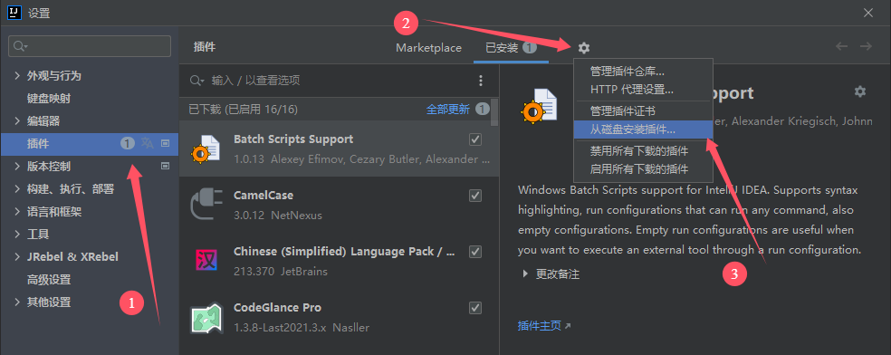
3.选择刚下载好的压缩包，安装完成后重启idea
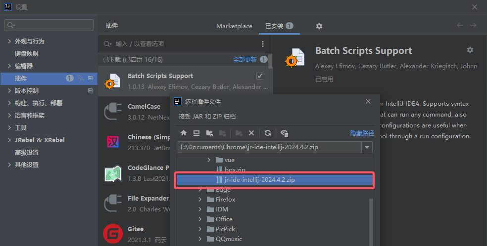
### 2.2激活

> 注意:如果是之前激活失效重新激活可能跟第一次页面不一样,并且激活失败,此问题参见4.1 激活失效后重新激活时报错

1.安装 JRebel 插件后，需要填写注册地址和邮箱来激活,以下位置打开激活窗口.
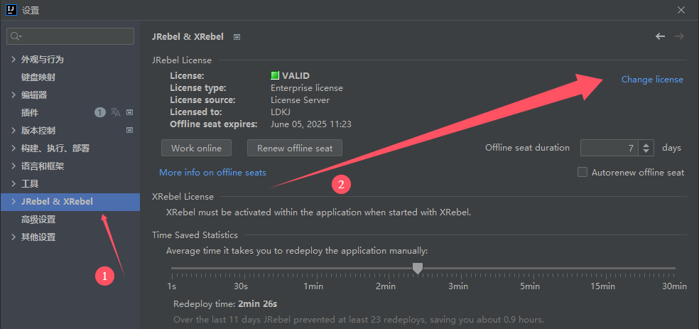
2.注册地址填写激活网址 + 生成的 GUID，邮箱随便填写
激活网址列表,一个不行就换另一个

```bash
http://jrebel-license.jiweichengzhu.com/{GUID}

https://jrebel.qekang.com/{GUID}

https://jrebel.com.cn/{GUID}

https://jrebel.idoudou.me/{GUID}

http://42.193.18.168:8088/{GUID}
```
3.GUID 可以使用如下地址在线生成，然后替换上面的{GUID}就行
GUID 生成在线链接：[在线GUID随机生成工具-Bejson.com](https://www.bejson.com/encrypt/gen_guid)
邮箱地址可随便输入，选择我同意，最后提交即可
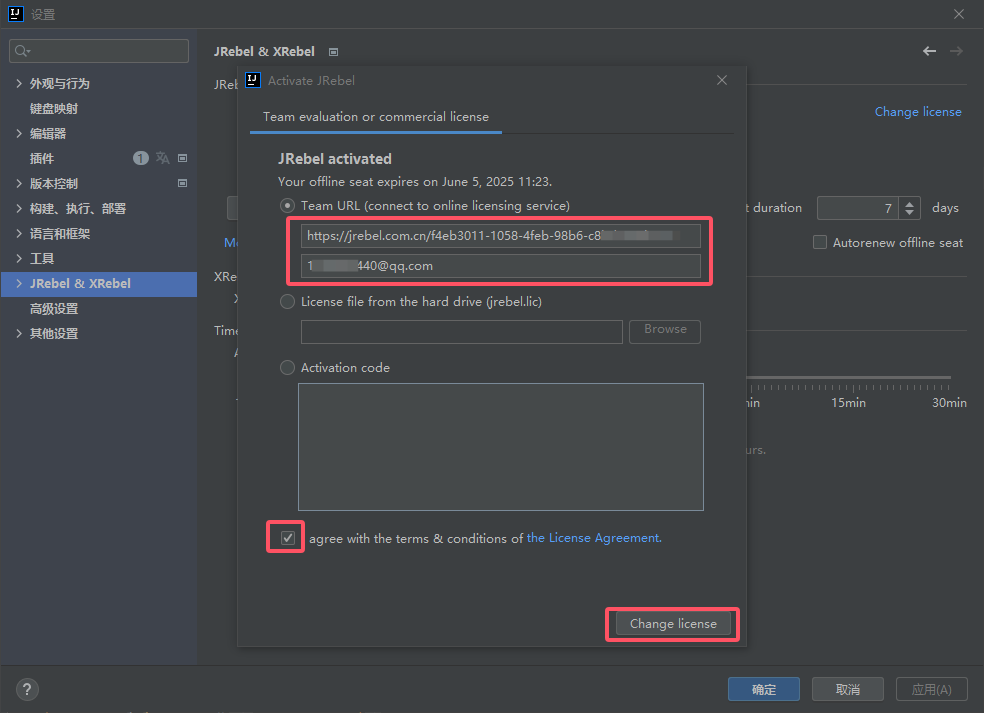

## 配置及使用
### 3.1配置
1.允许自动构建项目
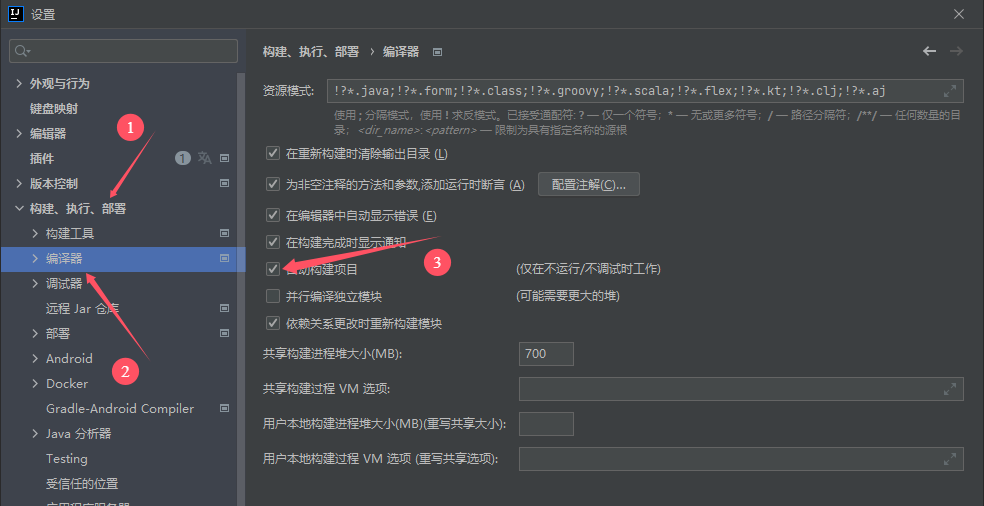
2.允许运行时重启
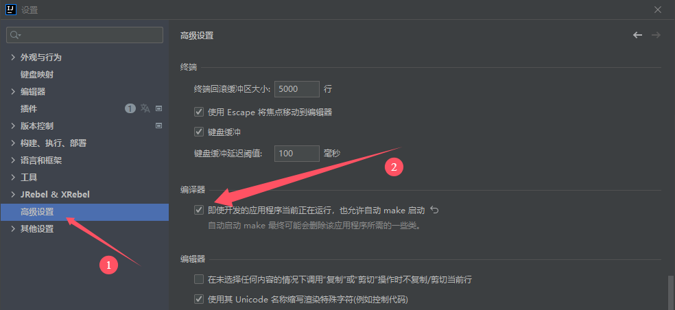
### 3.2使用
安装(完成后需重启),激活,配置都完成之后,可通过如下方式手动加载,其实会自动加载(前提服务得启动),但是自动加载有时候不是实时的.
1.先以热部署方式启动服务:打开Service服务窗口,选择要启动的服务,右键可以选择run或debug模式启动,有的版本在普通启动按钮旁边也会有热部署按钮(绿色火箭)
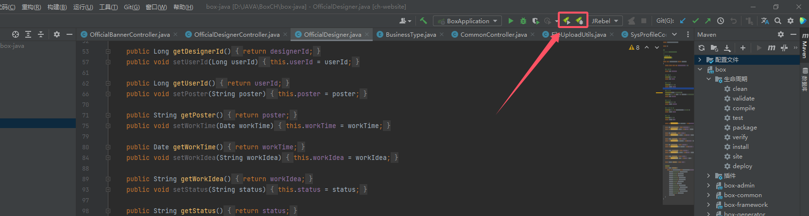
2.修改代码后通过快捷键 Ctrl+shift+F9手动加载,完成后右下角会弹出提示
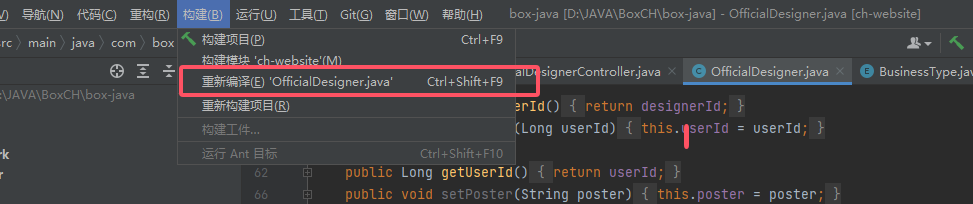
3.最后设置 JRebel 为离线，避免因为网络问题导致激活失效
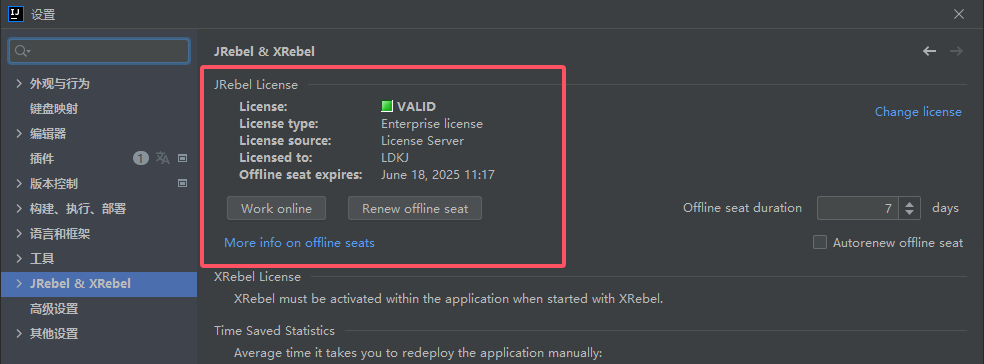

## 常见问题
### 4.1激活失效后重新激活时报错
1.如果出现如下页面,说明之前激活过,目前存在license的情况下去激活可能会报错
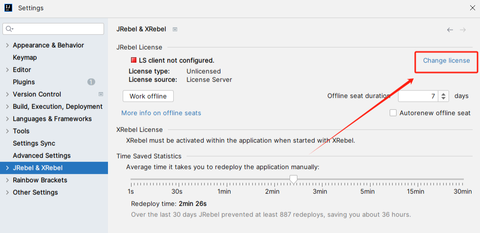
可以直接把当前的删掉,一劳永逸,修改还可能不成功.
直接点击如下位置,进入本地文件夹,把整个文件夹直接删掉.
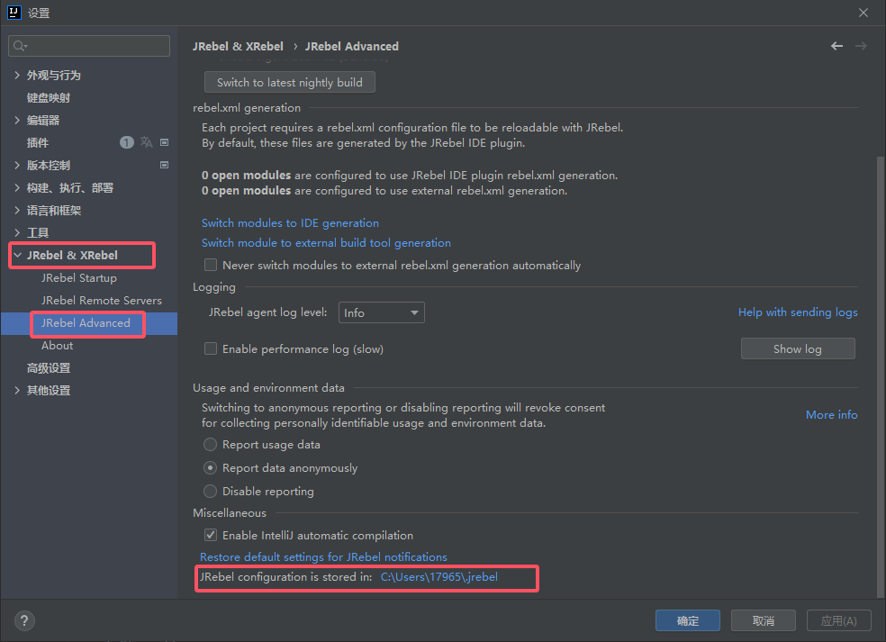
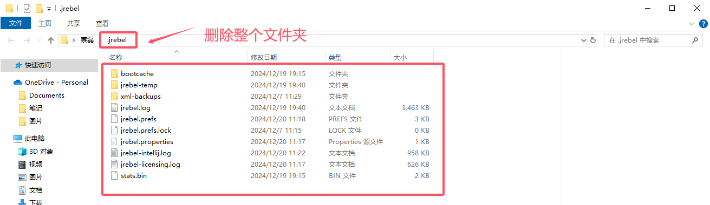
删除之后,就会和第一次激活一样,按照激活一步步激活即可.
### 4.2 xml文件改动无效
热加载时可能会发现xml文件改动未起作用,只需要下载一个插件即可
直接复制插件名:JRebel mybatisPlus extension,然后到idea的插件市场下载即可,甚至这个插件安装后不用重启哦!
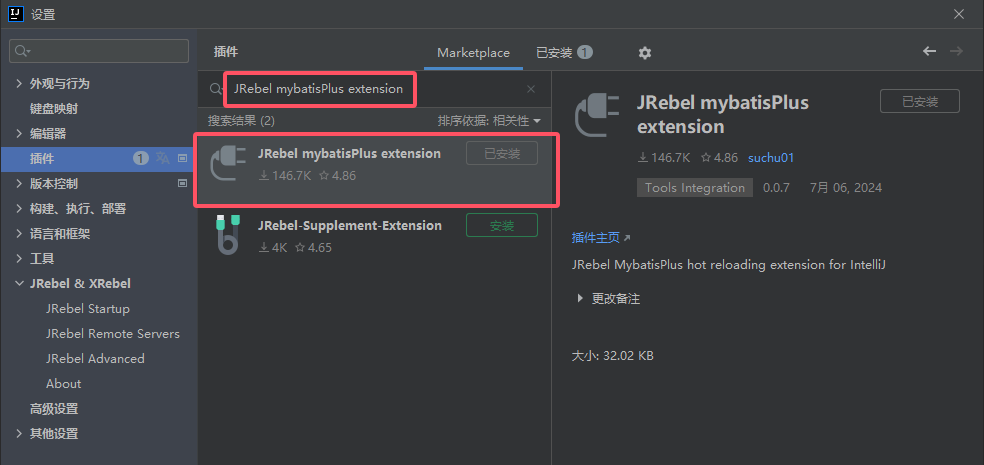