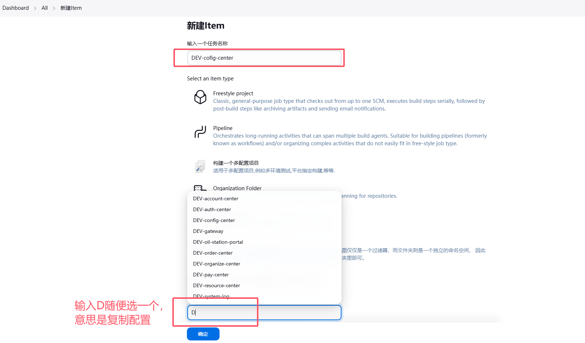
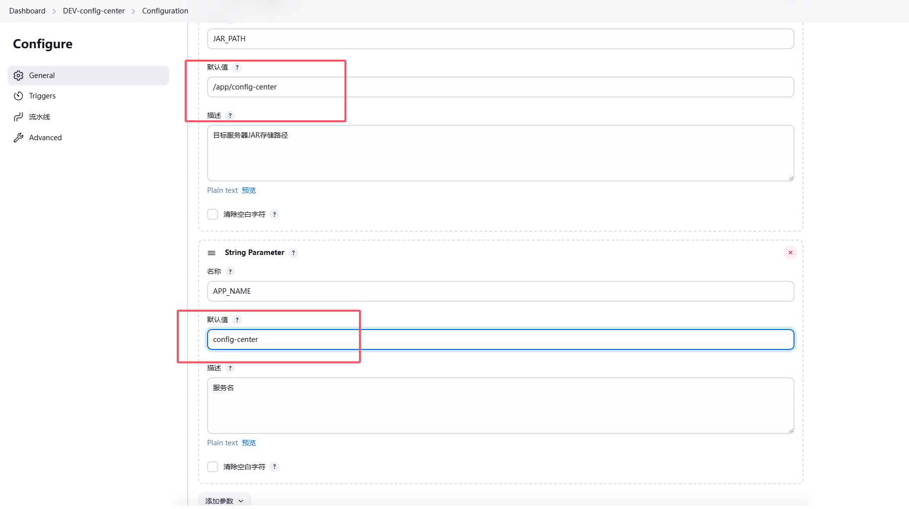
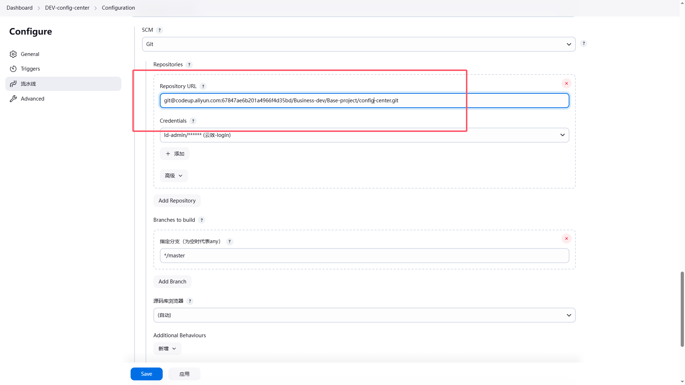
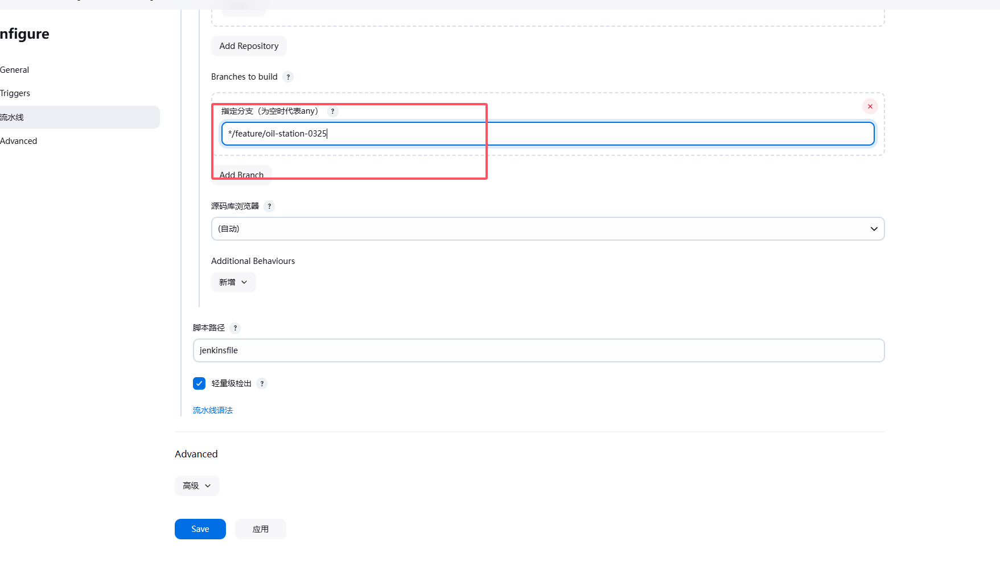
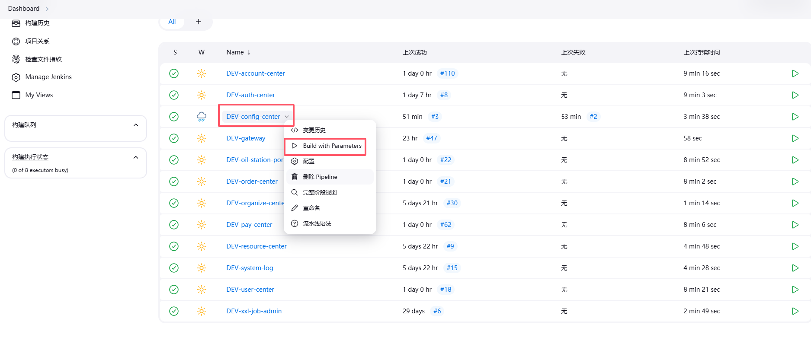
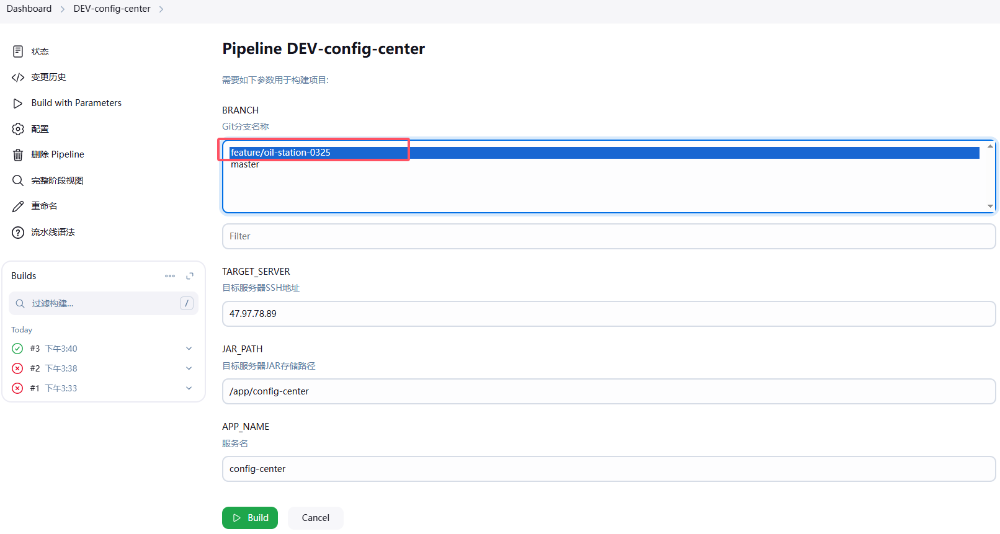
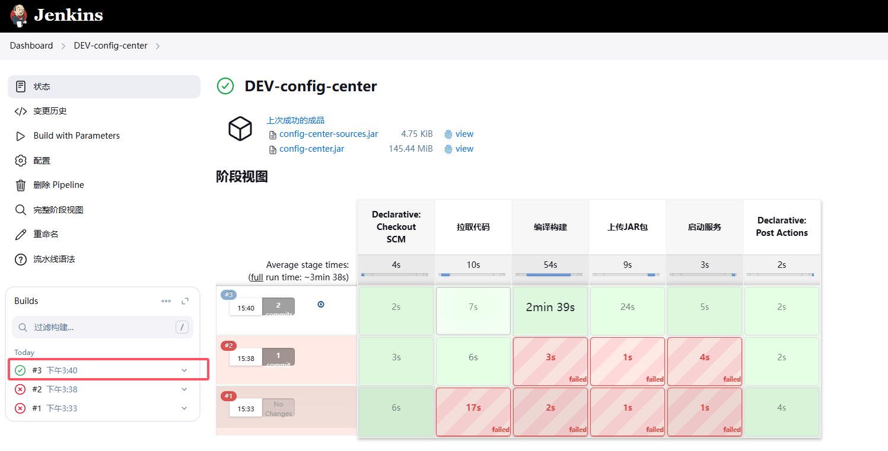
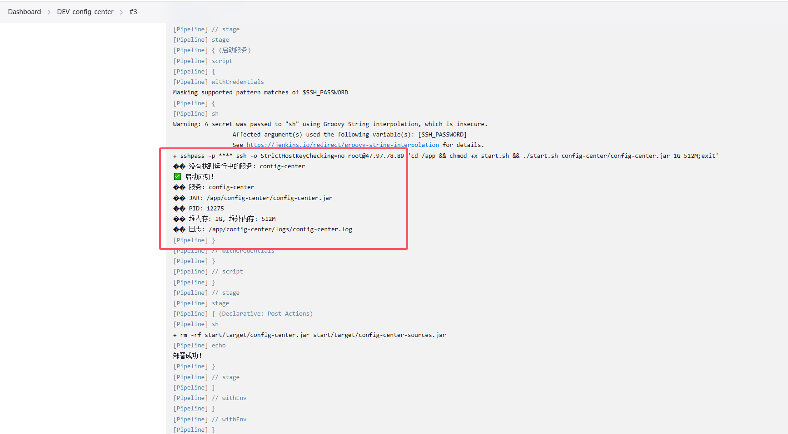
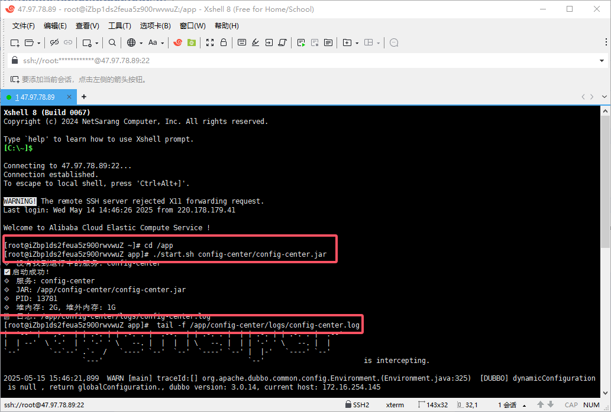

## 新建Item流程
1.输入一个任务名称，并且复制一个其他配置


2.输入“目标服务器JAR存储路径”和“服务名”


3.输入代码仓库地址


4.指定拉取的分支，点击“Save”


5.回到列表选择服务“Build”


6.选择分支“Build”


7.可以看到这样的视图，也可以点击“Builds”里面的详细；找到"Console Output"查看启动日志


8.启动成功


## 服务器查看日志

1.如果只需要运行jar包

```sh
cd /app/config-center         # 到指定jar包目录下
./start.sh config-center.jar  # 运行jar包
```

2.查看启动日志

```sh
tail -fn500 config-center.log   #实时查看 auth-center.log 文件的最后 500 行，并在文件更新时持续输出新内容。Ctrl + C退出
 ps -ef|grep java               #查看系统正在运行的 Java 进程
```

参考下图
