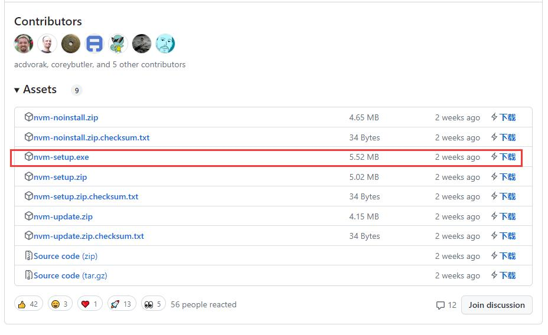

## 什么是nvm

nvm（Node Version Manager）是一款用于管理 Node.js 版本的工具，可以轻松地在一个系统中切换和安装多个 Node.js 版本。使用 nvm 可以让你轻松地升级或降级 Node.js 版本，也可以在同一台机器上同时使用多个版本的 Node.js。


## 下载及安装配置

### 下载
https://github.com/coreybutler/nvm-windows/releases


### 安装
接受协议

注意这里：默认安装到C盘，之后就不用配置环境变量了）


完成可以以下方式检测

如果安装到D盘，则需要配置相对应的环境，如图：（输入相对应的文件位置）


### 配置
找到nvm文件位置，点开settings.txt

然后在它后面输入以下代码：（这是配置镜像源）
```
node_mirror: https://npm.taobao.org/mirrors/node/
npm_mirror: https://npm.taobao.org/mirrors/npm/
```


## 使用nvm
1.先卸载之前的node.js

2.在刚刚的nvm文件位置打开cmd

3.输入以下代码查看nvm可安装的node版本
```sh
nvm ls                      // 看安装的所有node.js的版本
nvm list available          // 查显示可以安装的所有node.js的版本
```
4.安装所对应的版本。
```sh
nvm install 版本号 // 例如：nvm install 14.19.0
```
5.切换到安装的版本
```sh
nvm use 版本号           // 切换到使用指定的nodejs版本
```
6.检测是否切换完成，新开一个cmd
```sh
node -v
```

## nvm常用命令
```sh
nvm list ## 查看已经安装的版本
nvm list installed ## 查看已经安装的版本
nvm list available ## 查看网络可以安装的版本
 
nvm install ## 安装最新版本nvm
 
nvm use <version> ## 切换使用指定的版本node
 
nvm ls ## 列出所有版本
 
nvm current  ## 显示当前版本
 
nvm alias <name> <version> ## 给不同的版本号添加别名
 
nvm unalias <name> ## 删除已定义的别名
 
nvm reinstall-packages <version> ## 在当前版本node环境下，重新全局安装指定版本号的npm包
 
nvm on     ## 打开nodejs控制
 
nvm off    ## 关闭nodejs控制
 
nvm proxy  ## 查看设置与代理
 
nvm node_mirror [url] ## 设置或者查看setting.txt中的node_mirror，如果不设置的默认是 https://nodejs.org/dist/
nvm npm_mirror [url] ## 设置或者查看setting.txt中的npm_mirror,如果不设置的话默认的是： https://github.com/npm/npm/archive/.
 
nvm uninstall <version> ## 卸载制定的版本
 
nvm use [version] [arch] ## 切换制定的node版本和位数
 
nvm root [path] ## 设置和查看root路径
 
nvm version ## 查看当前的版本
```
